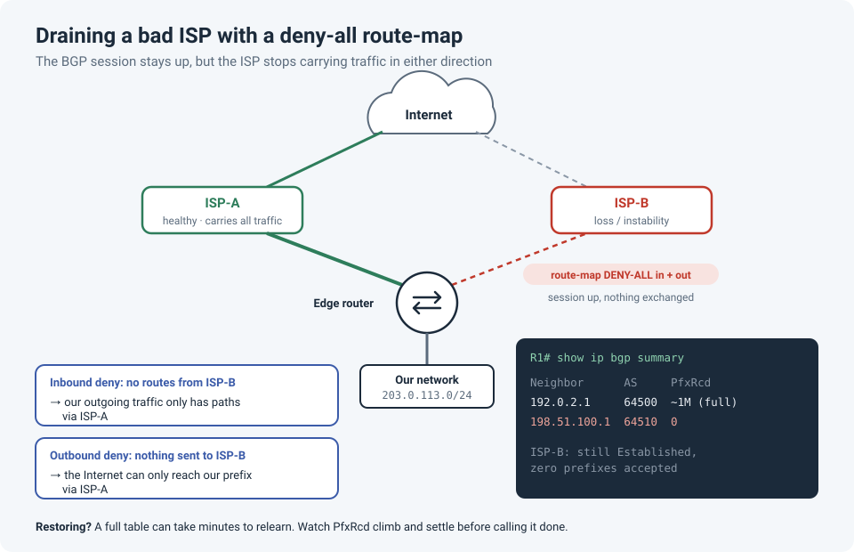

# Taking a Bad ISP Out of BGP Without Shutting the Session

We had two upstream ISPs, both running BGP to our edge router. One of them started having
problems, and we needed all traffic off it until they fixed it. Not later, but now, and without
making things worse.

!!! abstract "Key takeaway"
    Apply a **deny-all route-map** to the bad ISP's BGP neighbor, **inbound and outbound**,
    then soft-reset the session. Inbound stops you sending traffic *to* that ISP; outbound stops
    the Internet sending traffic *through* it. Then be patient: BGP convergence, especially
    relearning a full table when you restore, takes **minutes**, not seconds. Watch the
    prefix counts instead of guessing.



## Why both directions

BGP traffic engineering always has two halves, and each direction of the route-map controls one:

| Direction | What it does | Effect on traffic |
|---|---|---|
| **Inbound** (`in`) | We accept **no routes** from ISP-B | Our *outgoing* traffic has no path via ISP-B, so it all leaves via ISP-A |
| **Outbound** (`out`) | We advertise **nothing** to ISP-B | The Internet no longer sees our prefix via ISP-B, so *incoming* traffic arrives via ISP-A |

Do only one and you get **asymmetric routing**: traffic leaves via one ISP and returns via the
other, half your traffic still crosses the broken ISP, and stateful firewalls may drop it.

## The configuration

```
route-map DENY-ALL deny 10          ! no match clause = matches everything, denies it
!
router bgp 65001
 neighbor 198.51.100.1 route-map DENY-ALL in
 neighbor 198.51.100.1 route-map DENY-ALL out
!
clear ip bgp 198.51.100.1 soft      ! apply the new policy without dropping the session
```

Applying a route-map doesn't change anything on its own: BGP only evaluates policy when routes
are exchanged. The **soft reset** asks the neighbor to resend its routes (route refresh) and
re-sends ours, so the new policy takes effect while the session stays up. Avoid a plain
`clear ip bgp 198.51.100.1` (or worse, `clear ip bgp *`) in production: that's a **hard reset**
that drops the session.

## Verify it worked

```
show ip bgp summary                                     ! ISP-B: still up, PfxRcd drops to 0
show ip bgp neighbors 198.51.100.1 advertised-routes    ! should now be empty
show ip route summary                                   ! BGP routes now all via ISP-A
```

In `show ip bgp summary`, the `State/PfxRcd` column shows how many prefixes you've accepted
from each neighbor. If it shows a word like `Idle` or `Active` instead of a number, the
session itself is down. That's a different problem.

To check the outbound side, look from **outside**: a public BGP looking glass shows which
upstream the rest of the Internet now uses to reach your prefix.

## The part people underestimate: convergence time

Removing an ISP is fairly quick: your router drops the routes, and the withdrawal spreads
across the Internet, usually within seconds to a few minutes.

**Restoring is slower.** When you remove the route-map, your router has to relearn the
ISP's routes, and with a **full Internet table** that's roughly a million IPv4 prefixes. Depending
on the router, that can take several minutes, during which `PfxRcd` climbs steadily.

!!! danger "Don't declare victory too early"
    If you test immediately after restoring, the router may still be learning routes, and
    paths will keep shifting under you. Watch `show ip bgp summary` until `PfxRcd` for the
    restored ISP **stops climbing** and roughly matches the other full-table neighbor.

A sensible order when restoring:

1. Remove the **inbound** deny and soft-reset. Wait for the full table to load and settle.
2. Then remove the **outbound** deny and soft-reset. The Internet starts using that path again.
3. Watch traffic and the looking glass for a few minutes before closing the change.

## Other ways to do it

| Method | How | When to use it |
|---|---|---|
| **Deny-all route-map** (this post) | `route-map DENY-ALL` in + out | Take the ISP fully out of use, while keeping the session up so you can see when it's healthy again |
| **Shut the neighbor** | `neighbor 198.51.100.1 shutdown` | Simplest. But the session is down, so you can't watch it recover |
| **De-prefer instead of remove** | Lower `local-preference` inbound, AS-path prepend outbound | The ISP is degraded but still usable as a **backup** if the good one fails |

## Lessons learned

!!! tip "Takeaways"
    - Drain **both directions**, or you'll create asymmetric routing.
    - A route-map change needs a **soft** reset to take effect. Never hard-reset BGP in production.
    - Removing a path is fast; **relearning a full table takes minutes**. Plan for it.
    - Measure, don't guess: `PfxRcd` and a looking glass tell you when you're actually done.

## Reference

- Cisco: [BGP Case Studies](https://www.cisco.com/c/en/us/support/docs/ip/border-gateway-protocol-bgp/26634-bgp-toc.html) (route-maps, soft reconfiguration and route refresh)
