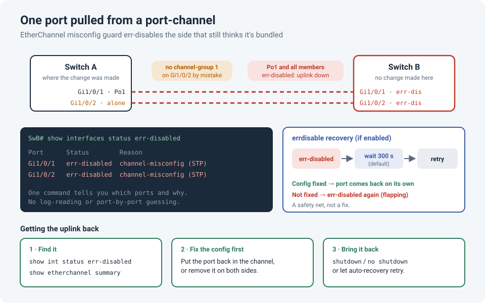

# One Port Pulled From a Port-Channel Took the Whole Uplink Down

We had a two-link port-channel between two switches. While making a change on one of
them, a port was removed from the channel by mistake. It felt minor: one link out of two, and
the other one was still there. Then the **whole** port-channel went down, on the switch
nobody had touched.

!!! abstract "Key takeaway"
    When one side of an EtherChannel stops bundling a port but the other side still does,
    **EtherChannel misconfig guard** sees a possible spanning-tree loop and err-disables the
    **entire** channel on the side that still bundles it. `show interfaces status err-disabled`
    tells you which ports went down and why in one line. Fix the config first, then bounce
    the ports or let **errdisable recovery** bring them back.



## What happened

| | Switch A (where the change was made) | Switch B (untouched) |
|---|---|---|
| Gi1/0/1 | Still in Po1 | In Po1, **err-disabled** |
| Gi1/0/2 | **Removed from Po1** by mistake, now a standalone port | In Po1, **err-disabled** |
| Po1 | Still up on this side | **err-disabled: uplink down** |

## Why the other switch shut it down

Switch B still treats both links as **one logical port**. Switch A now treats Gi1/0/2 as a
**separate** port. From Switch B's point of view, traffic it sends down the bundle can come
straight back on another link of the same bundle. That's exactly what a loop looks like.

Cisco Catalyst switches have **EtherChannel misconfig guard** enabled by default
(`spanning-tree etherchannel guard misconfig`). When it detects this, it err-disables the
channel to stop a possible loop. And it doesn't just disable one link: it takes down **every
member and the port-channel itself**. The logs look like this:

```
%SPANTREE-2-CHNL_MISCFG: Detected loop due to etherchannel misconfiguration of Gi1/0/2
%PM-4-ERR_DISABLE: channel-misconfig (STP) error detected on Po1, putting Gi1/0/1 in err-disable state
%PM-4-ERR_DISABLE: channel-misconfig (STP) error detected on Po1, putting Gi1/0/2 in err-disable state
%PM-4-ERR_DISABLE: channel-misconfig (STP) error detected on Po1, putting Po1 in err-disable state
```

It's a protection feature doing its job: a short outage is better than a spanning-tree loop
that melts the network. But it's a surprise if you don't know it exists.

!!! info "Static `mode on` hits hardest"
    This guard matters most for static channels (`channel-group 1 mode on`), which don't
    negotiate anything with the other side. With **LACP** (`mode active`), a mismatched member
    usually just goes **suspended** or **individual** instead of taking the whole bundle down.
    That alone is a good reason to prefer LACP.

## Finding it: one command

```
show interfaces status err-disabled
```

```
Port      Name   Status        Reason
Gi1/0/1          err-disabled  channel-misconfig (STP)
Gi1/0/2          err-disabled  channel-misconfig (STP)
```

That's the command I reach for first whenever a port is down unexpectedly. The **Reason**
column tells you *why* straight away, with no digging through logs or checking ports one by
one. Other common reasons you'll see there:

| Reason | Meaning |
|---|---|
| `channel-misconfig (STP)` | EtherChannel mismatch between the two ends (this story) |
| `bpduguard` | A BPDU arrived on a PortFast edge port, e.g. someone plugged in a switch |
| `psecure-violation` | Port security limit was hit |
| `link-flap` | The link went up and down too many times |
| `udld` | Unidirectional link detected, often a fiber problem |

On NX-OS, `show interface brief` has a similar **Reason** column.

## Getting it back

**1. Fix the config first.** Make both ends agree: put the port back in the channel on Switch
A, or remove it on **both** sides.

```
! Switch A: put Gi1/0/2 back, using the same mode as before
interface GigabitEthernet1/0/2
 channel-group 1 mode on
```

**2. Then bring the ports back up** on Switch B:

```
interface Port-channel1
 shutdown
 no shutdown
```

If members still show err-disabled afterwards, bounce them too
(`interface range Gi1/0/1 - 2`, then `shutdown` / `no shutdown`).

**3. Verify:**

```
show etherchannel summary          ! members flagged (P) = bundled
show interfaces status err-disabled  ! should now be empty
```

!!! warning "Bounce before fixing, and it comes straight back"
    If you `shutdown` / `no shutdown` while the config is still mismatched, the guard trips
    again within seconds. Fix the config on both ends first.

## Errdisable recovery: a safety net, not a fix

By default, an err-disabled port stays down until someone bounces it manually. **Errdisable
recovery** makes the switch retry on a timer:

```
errdisable recovery cause channel-misconfig
errdisable recovery interval 300        ! seconds; 300 is the default
show errdisable recovery                ! which causes recover, and time left per port
```

**The benefit:** if the cause has gone away (someone fixed the config, a loop cleared), the
link comes back on its own, even at a remote site in the middle of the night.

**The catch:** if the cause is still there, the port comes back, trips again and goes down
again every 5 minutes. Watch the logs for repeated `ERR_DISABLE` messages for the same port.
Enable recovery only for the causes you're comfortable auto-retrying, rather than with
`errdisable recovery cause all`.

## Lessons learned

!!! tip "Takeaways"
    - A port-channel is configured on **two** switches. Change one side, and check the other.
    - Misconfig guard err-disables the **whole** bundle, not just the mismatched link.
    - `show interfaces status err-disabled` is the fastest first command for any port that's
      unexpectedly down.
    - **Fix, then bounce.** Never the other way around.
    - Errdisable recovery is a safety net: great for transient causes, misleading for
      permanent ones.
    - Prefer **LACP** over static `mode on`: mistakes are far less dramatic.

## References

- Cisco: [Recover Errdisable Port State on Cisco IOS Platforms](https://www.cisco.com/c/en/us/support/docs/lan-switching/spanning-tree-protocol/69980-errdisable-recovery.html)
- Cisco Community: [Port status is errdisable due to EtherChannel misconfiguration](https://community.cisco.com/t5/networking-knowledge-base/port-status-is-errdisable-due-to-etherchannel-misconfiguration/ta-p/3131226)
