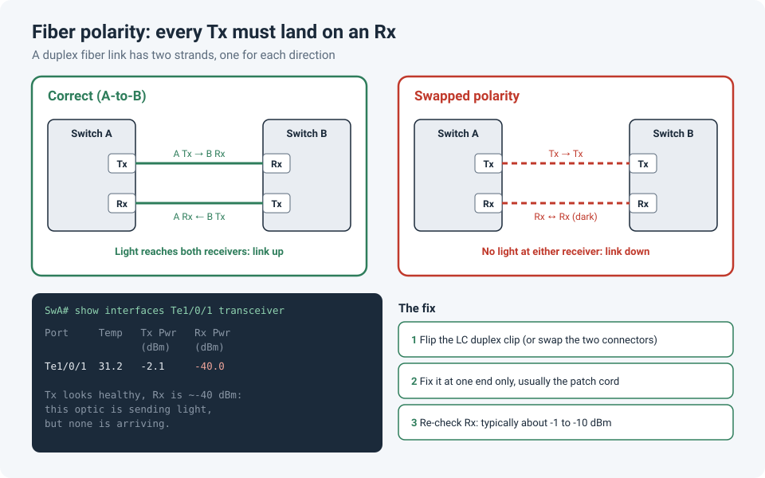

# Fiber Link Won't Come Up? Check the Polarity

A new fiber link is patched in, both optics are seated, both ports are configured, and the link
stays down. Before replacing optics or blaming the cabling contractor, check the simplest
possible cause: **polarity**. On a fiber link, one strand carries light in each direction, and
if the strands are swapped, transmit lands on transmit and nothing ever arrives.

!!! abstract "Key takeaway"
    On a duplex fiber link, every **Tx** must land on an **Rx**. Unlike copper, fiber ports
    have no Auto-MDI-X to sort this out for you. If both ends show normal **Tx power** but
    **Rx power around −40 dBm** (no light at all), suspect swapped polarity. The fix is to
    flip the strands at **one** end, usually by flipping the LC clip on the patch cord.



## What polarity means

A duplex fiber link uses two strands: one for each direction. The transmitter at one end
must connect to the receiver at the other end, in both directions.

On copper, you rarely think about this, because Ethernet ports use **Auto-MDI-X** to swap
transmit and receive pairs automatically. **Fiber ports have no equivalent.** The cabling
has to get it right.

The TIA-568 standard defines the **A-to-B** scheme for duplex patch cords: transmit (B)
should always connect to receive (A), no matter how many patch panels or cable segments sit in
between. Use standard A-to-B patch cords, follow the strand color code, and polarity takes care
of itself.

## How it goes wrong

Polarity problems usually come from somewhere in the middle of the path:

- **A patch cord of the wrong type**, e.g. an A-to-A (crossover) cord where an A-to-B cord was
  needed.
- **Inconsistent patch panel terminations**, where one end of a trunk was terminated in a
  different order from the other.
- **Someone "fixed" it at both ends.** Flipping both ends puts you right back where you
  started.
- **MPO/MTP trunks with mixed polarity methods.** These multi-fiber systems have three
  polarity methods (A, B and C), each needing specific patch cords. Mixing them is a classic
  source of errors.

## Diagnosing it: read the light levels

The optics tell you exactly what's happening, through DOM (digital optical monitoring):

```
show interfaces status | include notconnect        ! the link is down on both sides
show interfaces Te1/0/1 transceiver                ! Tx and Rx power
show interfaces Te1/0/1 transceiver detail         ! plus the alarm and warning thresholds
```

How to read the result:

| Tx power | Rx power | What it usually means |
|---|---|---|
| Normal | Normal (roughly −1 to −10 dBm for SR/LR) | Light is fine; look at configuration, speed or the far end |
| Normal | **About −40 dBm** (no light) on **both** ends | **Swapped polarity**, or a disconnected or broken path |
| Normal | About −40 dBm on **one** end only | One strand broken or unpatched; the link may go **unidirectional** (UDLD territory) |
| Normal | Weak (well below the optic's range, e.g. −18 dBm or lower) | Dirty connectors, too many joins, wrong fiber type, or a tight bend |
| Very low or alarming | Any | The optic itself may be failing |

Check the exact healthy range in the optic's data sheet; it varies by type.

!!! tip "A visual fault locator settles it"
    A **visual fault locator** (a small red laser pen for fiber) shines visible light down a
    strand, so you can see which strand comes out where at the far end. It's the fastest way
    to trace strands through patch panels.

!!! danger "Never look into a fiber or an optic"
    Most network optics use infrared light you **can't see**, and it can still damage your
    eyes. Never look into the end of a fiber, a patch cord or a transceiver port, even if the
    link looks dead.

## The fix

1. **Flip the strands at one end.** Many LC duplex patch cords have a clip you can rotate or
   open to swap the two connectors. Otherwise, separate the two LC connectors and swap them.
2. **One end only.** Fix it at a single point, ideally the patch cord at the equipment, not at
   both ends and not inside the trunk.
3. **Re-check the light levels.** Rx should now sit within the optic's normal range on both
   ends, and the link should come up.
4. **Label and document it.** If a patch panel position needed a crossover, note it, so the
   next person doesn't "fix" it back.

## Preventing it

- Use **A-to-B** patch cords as your standard, and keep any A-to-A crossovers clearly marked.
- Terminate both ends of every trunk in the **same strand order**, following the color code.
- For MPO/MTP systems, choose **one polarity method** for the whole site and stick to it.
- On handover, ask the installer for **polarity test results** along with loss tests.
  Professional fiber testers can verify polarity on patch cords, permanent links and channels.

## Lessons learned

!!! tip "Takeaways"
    - Fiber has no Auto-MDI-X: Tx must land on Rx, and the cabling has to get it right.
    - **Normal Tx, about −40 dBm Rx on both ends** is the classic signature of swapped polarity.
    - Fix it at **one** end only, then re-check the light levels.
    - Read the light levels before replacing optics. They tell you more than "link down" does.
    - Never look into a fiber.

## References

- Leviton: [Fiber Optic Polarity 101: A-B Polarity](https://blog.leviton.com/node/112)
- NetAlly: [No Auto-MDI-X Function on Fiber Interfaces: Time to Talk About "Polarity"](https://www.netally.com/?p=98065)
- Accu-Tech (with Fluke Networks): [The ABCs of Fiber Polarity](https://www.accu-tech.com/accu-insider/the-abcs-of-fiber-polarity)
