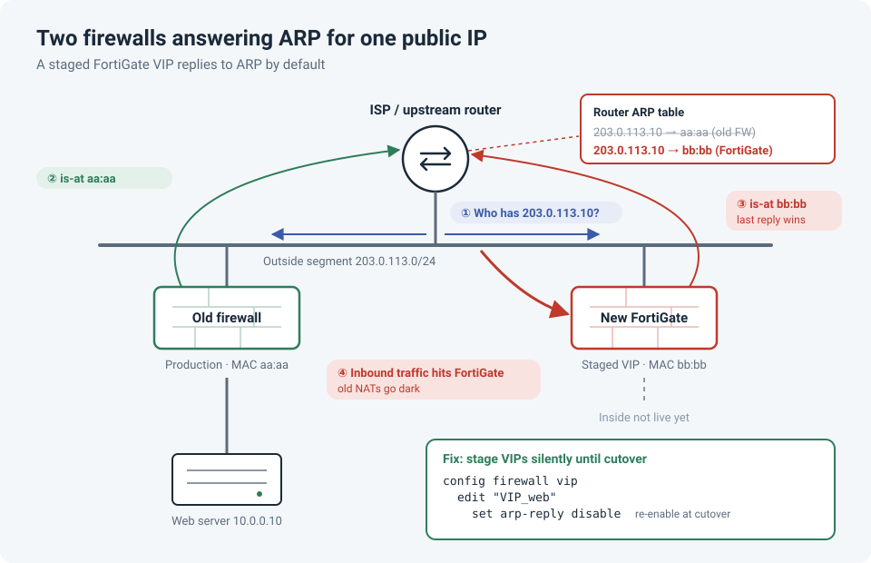

# Pre-Staging FortiGate VIPs Took Down the Old Firewall's NATs

We were migrating from an old firewall to a new FortiGate. To make the cutover night
smoother, we did the sensible thing: we built the configuration ahead of time, including the
**VIPs** (FortiGate's destination NAT objects) for every published service.

The cutover hadn't happened yet. But the old firewall's NATs went down anyway.

!!! abstract "Key takeaway"
    A FortiGate VIP has **`arp-reply` enabled by default**. As soon as the VIP exists and the
    FortiGate is connected to the same outside segment, it starts answering ARP for those
    public IPs, competing with the old firewall that still owns them. Stage VIPs with
    `set arp-reply disable` (or keep the outside interface down) until the cutover.



## The setup

| | Old firewall | New FortiGate |
|---|---|---|
| Outside interface | On `203.0.113.0/24` | **Also connected** to `203.0.113.0/24`, ready for cutover |
| Public IP `203.0.113.10` | Owns it, NATs it to the web server | Has a VIP for it, staged for later |
| Inside network | Live | Not connected yet |

On paper, the FortiGate was idle. Nothing pointed at it yet.

## What actually happened

1. The upstream router needed the MAC address for `203.0.113.10`, so it sent an **ARP request**.
2. The old firewall replied: *"203.0.113.10 is at aa:aa"*.
3. The FortiGate **also replied**: *"203.0.113.10 is at bb:bb"*, because its VIP had
   `arp-reply` enabled.
4. The router's ARP cache simply keeps the latest answer, so it ended up pointing at the
   FortiGate.
5. Inbound traffic for the published services went to a firewall that had no inside path
   yet. The services were down.

!!! danger "Why this is confusing to troubleshoot"
    Nothing changed on the old firewall, and its config and logs look perfect. Because both
    devices keep answering, the router's ARP entry can **flip between them**, so the outage
    can look intermittent.

## How to confirm it

Compare the MAC the router has with each firewall's MAC:

```
! Upstream router (Cisco IOS)
show ip arp 203.0.113.10                       ! which MAC owns the public IP right now?
```

```
# FortiGate
diagnose hardware deviceinfo nic wan1 | grep HWaddr   # this firewall's MAC
diagnose sniffer packet wan1 'arp' 4                  # watch it answer ARP requests live
get system arp                                        # its own ARP table
```

If the router shows the FortiGate's MAC for an IP the old firewall should own, and the sniffer
shows the FortiGate replying, you've found it.

## The fix

**Stage the VIPs silently:**

```
config firewall vip
    edit "VIP_web"
        set arp-reply disable
    next
end
```

Alternatively, keep the FortiGate's outside interface **administratively down** (or unplugged)
until the cutover window starts.

!!! warning "Don't forget IP pools"
    FortiGate **IP pools** (used for source NAT) also have `arp-reply`, enabled by default.
    If you staged IP pools on addresses the old firewall still uses, they need the same
    treatment.

## Cutover checklist

- [ ] Disconnect or shut down the old firewall's outside interface
- [ ] On the FortiGate, set `arp-reply enable` on each VIP and IP pool
- [ ] Clear the stale ARP entries upstream: `clear ip arp 203.0.113.10` on the router, or ask the ISP if they own it
- [ ] Verify with `show ip arp` that the router now has the FortiGate's MAC
- [ ] Test every published service from **outside** the network
- [ ] Keep the old firewall configured and ready until rollback is no longer needed

The upstream router's ARP cache is the same trap as stale MAC/ARP tables anywhere: on Cisco
IOS the default ARP timeout is **4 hours**, so a stale entry won't fix itself during your
change window. The FortiGate sends a gratuitous ARP when its interface comes up, which usually
updates neighbours, but don't rely on it: check.

## Lessons learned

!!! tip "Takeaways"
    - On a shared segment, **anything that can answer ARP is already live**, even if no
      traffic is "supposed" to reach it yet.
    - Read the defaults on staged objects. On FortiGate, VIPs and IP pools both reply to ARP
      by default.
    - Pre-staging is still the right idea. Just stage it **silently**.
    - When "nothing changed" on a device but its traffic stopped, look at what changed
      **next to it**.

## Reference

- Fortinet Community: [Technical Tip: ARP reply setting in Virtual IP/IP Pool](https://community.fortinet.com/t5/FortiGate/Technical-Tip-ARP-reply-setting-in-Virtual-IP-IP-Pool/ta-p/192527)
