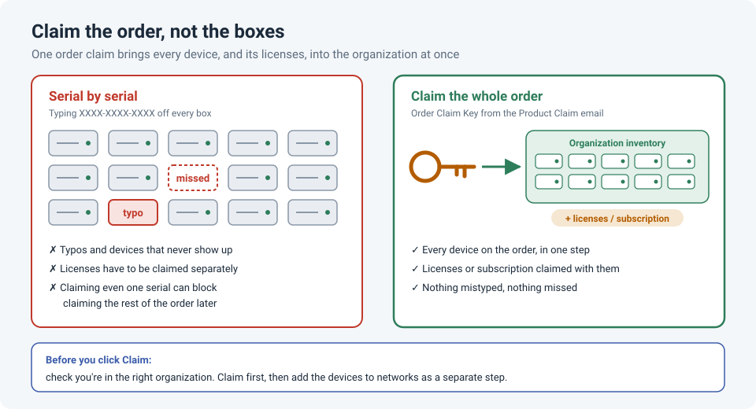

# Adding Meraki Devices: Claim the Order, Not the Serial Numbers

<!-- EDIT ME: open with a real moment, e.g. a stack of boxes and typing serials one by one,
     a device that never showed up in the dashboard, or licenses that didn't come in.
     Keep names and companies out. -->

Before a Meraki device can do anything, it has to be **claimed** into your organization's
inventory in the dashboard. The obvious way is to read the serial number off each box and type
it in. It works, but it's slow, error-prone, and it can make the rest of the order harder to
claim later.

The better habit is to **claim the whole order** at once.

!!! abstract "Key takeaway"
    Claim Meraki devices by **order**, not one serial number at a time. An order claim adds
    **every device and its licensing** to the organization in one step. Claim the order
    **first**: once any device from an order has been claimed individually, the rest of the
    order can no longer be claimed as a whole. And check you're in the **right organization**
    before you click Claim.

## Two ways to claim

| | Serial by serial | Claim the whole order |
|---|---|---|
| What you enter | `XXXX-XXXX-XXXX` from each device | One order claim key (or order number on older orders) |
| Devices added | One at a time | Every device on the order |
| Licenses | Claimed separately | Claimed along with the devices |
| Risk | Typos, missed devices | Claiming into the wrong organization |

According to Meraki's documentation, entering an order into the claim tool **claims all the
devices and licensing included in that order at the same time**. Meraki community experts
give the same advice: claim by order whenever you can, and claim individual serials mainly
for things like hardware replacements.

!!! info "Order number or Order Claim Key?"
    Meraki has been moving away from the plain **order number**. Their current inventory
    documentation says claiming by Meraki order number has been **deprecated**, and that
    devices should be claimed with the **Order Claim Key** from your **Product Claim email**.
    The principle is the same: one key, the whole order. If your order includes a software
    subscription, the claim process asks whether to **Claim Subscription & Devices** or only
    the devices.

## The trap: claim one serial, lose the order claim

This is the part that catches people. Meraki's documentation is explicit: **if any device from
an order has already been claimed, the remaining devices can't be claimed using the order.**

A typical way it happens: one engineer claims a single AP by serial to test it, and later
someone tries to claim the full order. It fails, and now every remaining device has to be
claimed one by one.

**If it happens to you,** Meraki documents two options:

- Claim the remaining devices **individually** by serial number. The serial is on a label on
  the back of each device, and there's a barcode you can scan.
- Or **remove** the already-claimed devices from the organization, wait **5–60 minutes**, and
  claim the whole order again. This doesn't work if the order's **license key** has already
  been claimed; then everything has to be claimed individually.

## Before you click Claim

- [ ] You're in the **right organization**. Moving a claimed device to another organization is
      awkward and can need Meraki support.
- [ ] You have **organization-level** admin rights. Network-only admins can't claim devices
      into the organization inventory.
- [ ] For **Catalyst** devices managed by Meraki, you're using the **Cloud ID** (the Meraki
      serial), not the Cisco serial number. The Cisco serial can't be used to claim.
- [ ] Nobody has already claimed part of the order by serial.

## After claiming

Claiming only puts the devices into the **organization inventory**. As a separate step, add
them to the right **network** (site) and confirm the licensing looks correct under the
organization's license or subscription page.

!!! tip "Keep the order details with your project docs"
    Save the order number or claim key alongside your site documentation. It's the fastest way
    to trace which devices and licenses came from which purchase, especially months later
    when a renewal or RMA comes up.

## Automating it

For large rollouts, the Meraki Dashboard API can claim **orders, serials and licenses**
straight into an organization's inventory (`POST /organizations/{organizationId}/inventory/claim`).
When you claim by order through the API, all devices and licenses in that order are claimed
together, the same as in the dashboard. The same operation is available as a Cisco Ansible
module (`cisco.meraki.organizations_inventory_claim`) if you manage Meraki with Ansible.

## Lessons learned

!!! tip "Takeaways"
    - Claim the **whole order**, not one serial at a time.
    - Claim the order **first**. Claiming a single device individually can block the order
      claim for everything else.
    - Check the **organization** before clicking Claim.
    - Claiming isn't deploying: add the devices to their **network** as a separate step.
    - Use the **Order Claim Key** from the Product Claim email; the plain order number is being
      phased out.

<!-- EDIT ME: add a short "What happened to me" section: how many devices, what went wrong
     with serial-by-serial claiming (if anything), and what you do now. -->

## References

- Meraki Documentation: [Using the Organization Inventory](https://documentation.meraki.com/General_Administration/Inventory_and_Devices/Using_the_Organization_Inventory)
- Meraki Documentation: [Cannot Add Devices Using Cisco Meraki Order Number](https://documentation.meraki.com/General_Administration/Inventory_and_Devices/Cannot_Add_Devices_Using_Cisco_Meraki_Order_Number)
- Meraki Documentation: [Meraki Hardware and Software Onboarding Guide](https://documentation.meraki.com/General_Administration/Licensing/Meraki_Hardware_and_Software_Onboarding_Guide)
- Meraki Community: [License required after adding more devices](https://community.meraki.com/t5/Dashboard-Administration/License-required-after-adding-more-devices/m-p/236490)
