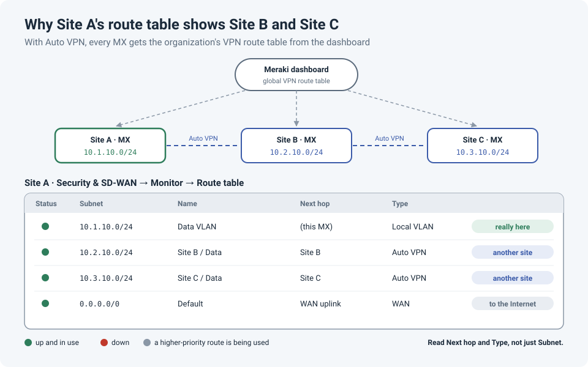

# Reading the Meraki Route Table: Why One Site Shows the Whole Organization

The first time you open the route table of a Meraki MX, it can be confusing. You're looking at
**one** network, but the table is full of subnets that clearly belong to **other** sites. Is
this site routing all of them? Are they configured here? Which ones are actually local?

The short answer: this is **Auto VPN** at work, and the table makes sense once you know which
columns to read.

!!! abstract "Key takeaway"
    With Auto VPN, every MX downloads the **organization's VPN route table** from the Meraki
    dashboard, so each site's route table lists the subnets of every other site in the VPN.
    To tell what's actually local, read the **Next hop** and **Type** columns, not just the
    subnet. And remember the routing priority: **Auto VPN routes win** over IPsec peers, BGP
    and NAT, even when the Auto VPN route is down.

## Why other sites show up

Meraki's documentation explains how Auto VPN builds routes: each MX **downloads the global VPN
route table from the dashboard**, which the dashboard generates automatically from the WAN IP
and local subnets that every MX advertises into the VPN.

An MX that takes part in Auto VPN then **automatically creates routes for every subnet in the
Auto VPN topology**. So Site A's route table correctly includes Site B's and Site C's subnets,
because Site A really does route to them, through the VPN. They're not configured at Site A, and
they don't live there.

## How to read the table

The route table is at **Security & SD-WAN → Monitor → Route table**. Per Meraki's docs, the
columns mean:

| Column | What it tells you |
|---|---|
| **Status** | 🟢 up and being used · 🔴 currently down · ⚪ grey: there's more than one route to this subnet and a higher-priority one is being used |
| **Name** | For local subnets, the VLAN name or static route description. For Auto VPN subnets, the **remote site's dashboard network name** plus its VLAN name |
| **Next hop** | For an Auto VPN route, the **name of the remote network** it's reached through. For a non-Meraki VPN, the peer's name |
| **Type** | How the subnet is reached: local VLAN, static route, Auto VPN, WAN and so on |

So the quick way to answer "is this subnet here?":

- **Type is a local VLAN** → it lives at this site.
- **Type is Auto VPN and Next hop names another network** → it lives at that other site, and this MX just knows how to reach it.

!!! tip "Use it as a site finder"
    Trying to work out which site a subnet belongs to? Search for it in any MX's route table:
    the **Next hop** tells you which network owns it.

!!! info "Things that look odd but are normal"
    - The **default route (0.0.0.0/0) points to the WAN uplink**: that's the MX's gateway
      of last resort. On spokes using **full tunnel**, the default route is learned through
      Auto VPN from the exit hub instead.
    - If the table doesn't reflect a recent change, the **Rebuild** button refreshes the
      dashboard's view of the route table.
    - Meraki has introduced a newer version of this page, so the layout may look slightly
      different between organizations.

## Controlling what other sites see

Whether a local subnet appears in the other sites' route tables is decided on **Security &
SD-WAN → Configure → Site-to-site VPN**, where each local network's VPN participation is set.
A subnet with VPN mode **disabled** isn't part of the VPN route table, so other sites won't
learn it.

That's the setting to check when a site says "we can't reach your new VLAN": it may simply not
be in the VPN.

## The gotcha: Auto VPN routes win, even when they're down

This is the one that bites during troubleshooting. Meraki documents that **Auto VPN routes
take precedence over IPsec VPN peers, BGP-learned routes and NAT, even when the Auto VPN
routes are down**.

So if the same subnet is reachable both through Auto VPN and through, say, a third-party IPsec
tunnel or BGP, the MX keeps choosing the Auto VPN route. And if that Auto VPN path goes down,
traffic doesn't quietly fail over to the other route.

!!! danger "Overlapping subnets make it worse"
    If two sites advertise the **same subnet** into Auto VPN, the route table gets hard to
    read and traffic may go to the wrong site. Keep every site's subnets unique, and see the
    [overlapping subnets post](overlapping-subnets-ipsec.md) for what to do when you can't.

## Lessons learned

!!! tip "Takeaways"
    - A Meraki MX route table shows the **whole Auto VPN topology**, not just the local site.
    - Read **Type** and **Next hop** to tell local subnets from remote ones.
    - **Grey** status means a better route exists, not that something is broken.
    - VPN participation per subnet is set on the **Site-to-site VPN** page.
    - **Auto VPN routes take priority** over IPsec peers, BGP and NAT, even when down. Design
      around that.

## References

- Meraki Documentation: [Route Table](https://documentation.meraki.com/MX/Networks_and_Routing/Route_Table)
- Meraki Documentation: [MX Routing Behavior](https://documentation.meraki.com/MX/Networks_and_Routing/MX_Routing_Behavior)
- Meraki Documentation: [Site-to-site VPN Settings](https://documentation.meraki.com/MX/Site-to-site_VPN/Site-to-site_VPN_Settings)
- Meraki Community: [Where can I see the default route?](https://community.meraki.com/t5/Security-SD-WAN/Where-can-I-see-the-default-route/m-p/98004)
