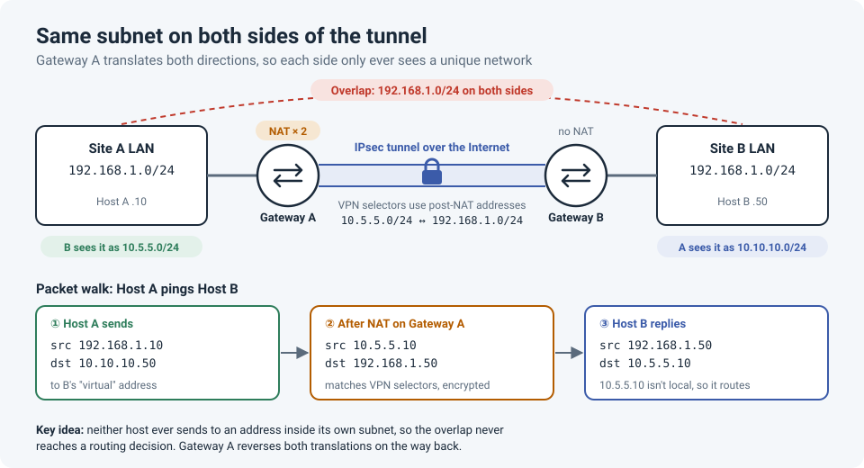

# Overlapping Subnets Across an IPsec Tunnel

We needed a site-to-site IPsec tunnel between two networks, and both sides were using the
same private range. The tunnel itself was easy. Getting traffic through it was not.

!!! abstract "Key takeaway"
    When the **same subnet exists on both ends** of a VPN, routing alone can't fix it:
    hosts never even send the traffic to their gateway. The fix is **NAT**: present each
    side to the other as a unique **virtual subnet**. The idea is the same on every
    platform; only the configuration differs. **PBR** helps only when the overlap is
    *partial* (a route conflict), not when the subnets are identical.



## The situation

| | Site A (us) | Site B (remote) |
|---|---|---|
| LAN | `192.168.1.0/24` | `192.168.1.0/24` |
| VPN peer | Gateway A | Gateway B |

Re-addressing either side wasn't an option in the time we had, so the overlap had to be
handled on the network.

## Why it breaks

!!! danger "Three things go wrong at once"
    1. **Hosts don't route it.** Host A wants to reach `192.168.1.50`. That's in its own
       subnet, so it ARPs locally instead of sending to the gateway. The packet never
       reaches the firewall or router, let alone the tunnel.
    2. **The gateway can't route it.** Gateway A has `192.168.1.0/24` as a *connected*
       network. A connected route always beats anything learned for the remote side.
    3. **The VPN selectors are ambiguous.** Whatever your platform calls them (crypto ACL on
       Cisco, phase 2 selectors on FortiGate, proxy IDs on Palo Alto), "192.168.1.0/24 to
       192.168.1.0/24" is meaningless: source and destination are the same network.

So the goal is simple: **neither host may ever send to an address in its own subnet.**

## The fix: virtual subnets

Give each site a **virtual subnet** that the other side uses instead of the real one:

- Site A (`192.168.1.0/24`) is presented to Site B as **`10.5.5.0/24`**
- Site B (`192.168.1.0/24`) is presented to Site A as **`10.10.10.0/24`**

Users at Site A reach Host B (`192.168.1.50`) at **`10.10.10.50`**.

There are two ways to arrange the translations:

| Design | Who translates | When to use it |
|---|---|---|
| **Each side translates itself** | Gateway A maps its LAN to `10.5.5.0/24`; Gateway B maps its LAN to `10.10.10.0/24` | You control both ends. Cleanest and most symmetrical. |
| **One side does both** | Gateway A translates its own LAN **and** Site B's LAN; Gateway B changes nothing | The other side is a partner or customer who can't or won't make changes |

### Rules that apply on every platform

- **Virtual subnets must be the same size** as the real ones, so every host maps one-to-one.
- **The VPN selectors use post-NAT addresses** (`10.5.5.0/24` ↔ `10.10.10.0/24`, from Site A's
  point of view), because translation happens before encryption.
- **Route the remote virtual subnet into the tunnel.**
- **Exempt VPN traffic from Internet NAT/PAT.** If it gets PAT'd to the public IP first, it
  no longer matches the VPN selectors and never enters the tunnel.
- **Scope the translation to VPN traffic only**, so Internet-bound traffic isn't translated
  to the virtual subnet.

## Configuration by platform

=== "Cisco IOS"

    This example uses the **one side does both** design: Router A translates both
    directions, and Router B needs no NAT at all.

    ```
    interface GigabitEthernet0/1
     description LAN
     ip address 192.168.1.1 255.255.255.0
     ip nat inside
    !
    interface GigabitEthernet0/0
     description WAN
     ip nat outside
     crypto map VPN-B
    !
    ! Our LAN as seen by Site B
    ip nat inside source static network 192.168.1.0 10.5.5.0 /24
    ! Site B's LAN as seen by us
    ip nat outside source static network 192.168.1.0 10.10.10.0 /24
    !
    ! Crypto ACL uses POST-NAT addresses
    ip access-list extended VPN-TO-B
     permit ip 10.5.5.0 0.0.0.255 192.168.1.0 0.0.0.255
    !
    crypto map VPN-B 10 ipsec-isakmp
     set peer 198.51.100.2
     set transform-set TS-AES
     match address VPN-TO-B
    ```

    **Router B** only needs the mirror crypto ACL, plus a NAT exemption for `10.5.5.0/24`
    if it overloads its LAN to the Internet:

    ```
    ip access-list extended VPN-TO-A
     permit ip 192.168.1.0 0.0.0.255 10.5.5.0 0.0.0.255
    ```

    !!! warning "Static network NAT also hits Internet traffic"
        `ip nat inside source static network` translates *everything* from the LAN,
        including Internet-bound traffic, and can break normal PAT. Some IOS versions
        support a `route-map` on static NAT to limit it to VPN traffic; on others, only
        one-to-one host statics do. Check your platform, or do the translation on a firewall
        where NAT is scoped by policy.

=== "FortiGate"

    This follows Fortinet's documented design for a **route-based** tunnel, where **each
    side translates itself**: an **IP pool** for source NAT on the way out, and a **VIP** on
    the tunnel interface for destination NAT on the way in. Shown for Site A; Site B
    mirrors it with `10.10.10.0/24`.

    ```
    # Source NAT: our real LAN -> our virtual subnet (one-to-one)
    config firewall ippool
        edit "SiteA-virtual"
            set type fixed-port-range
            set startip 10.5.5.1
            set endip 10.5.5.254
            set source-startip 192.168.1.1
            set source-endip 192.168.1.254
        next
    end

    # Destination NAT: traffic from the tunnel to our virtual subnet -> real LAN
    config firewall vip
        edit "SiteA-virtual-in"
            set extintf "VPN-to-B"
            set extip 10.5.5.1-10.5.5.254
            set mappedip "192.168.1.1-192.168.1.254"
        next
    end

    config firewall policy
        edit 0
            set name "LAN-to-SiteB"
            set srcintf "internal"
            set dstintf "VPN-to-B"
            set srcaddr "SiteA-LAN-192.168.1.0"
            set dstaddr "SiteB-virtual-10.10.10.0"
            set action accept
            set schedule "always"
            set service "ALL"
            set nat enable
            set ippool enable
            set poolname "SiteA-virtual"
        next
        edit 0
            set name "SiteB-to-LAN"
            set srcintf "VPN-to-B"
            set dstintf "internal"
            set srcaddr "SiteB-virtual-10.10.10.0"
            set dstaddr "SiteA-virtual-in"
            set action accept
            set schedule "always"
            set service "ALL"
        next
    end

    # Route the remote virtual subnet into the tunnel
    config router static
        edit 0
            set dst 10.10.10.0 255.255.255.0
            set device "VPN-to-B"
        next
    end
    ```

    Set the phase 2 selectors to `10.5.5.0/24` ↔ `10.10.10.0/24`. Fortinet also recommends a
    **blackhole route** for the remote subnet with a higher distance, so traffic isn't sent
    out the default route to the Internet if the tunnel goes down. If your FortiGate uses
    **central SNAT** mode, the NAT lives in the central SNAT table instead of the policy;
    Fortinet has a separate guide for that (see references).

=== "Palo Alto"

    Palo Alto handles this with NAT rules plus a route into the tunnel. Shown for Site A
    with **each side translating itself**; Site B mirrors it with `10.10.10.0/24`.

    1. **Route:** add a static route for `10.10.10.0/24` via the tunnel interface
       (e.g. `tunnel.1` in zone `vpn`).
    2. **Source NAT rule** (outbound): from zone `trust` to zone `vpn`, source
       `192.168.1.0/24`, destination `10.10.10.0/24`. Translation: **Static IP** to
       `10.5.5.0/24`.
    3. **Destination NAT rule** (inbound): from zone `vpn`, destination `10.5.5.0/24`.
       Translation: destination **Static IP** to `192.168.1.0/24`.
    4. **Security policies** allowing the traffic in both directions.
    5. **Proxy IDs:** if the peer is a policy-based VPN, set local `10.5.5.0/24` and remote
       `10.10.10.0/24`, the post-NAT addresses.

    !!! warning "The Palo Alto zone rules trip everyone up"
        **NAT rules** are written with **pre-NAT zones** (the zones matching the addresses
        *before* translation). **Security rules** are written with **pre-NAT addresses** but
        **post-NAT zones**. Get these backwards and the rule simply never matches. Check the
        traffic log to confirm NAT is applied.

    You can tick **bi-directional** on a static source NAT rule instead of writing a separate
    destination NAT rule. For VPN NAT, many engineers prefer separate, explicit source and
    destination rules, because they're easier to read and troubleshoot.

## Packet walk

The same on every platform (shown for the "one side does both" design):

| Step | Where | Source | Destination |
|---|---|---|---|
| 1 | Host A sends | `192.168.1.10` | `10.10.10.50` |
| 2 | After NAT on Gateway A, encrypted | `10.5.5.10` | `192.168.1.50` |
| 3 | Host B replies | `192.168.1.50` | `10.5.5.10` |
| 4 | Gateway A reverses both NATs | `10.10.10.50` | `192.168.1.10` |

In step 3, Host B sees `10.5.5.10` as an *off-subnet* address, so it sends the reply to its
gateway, and it goes back into the tunnel. That's the whole trick.

## Verify

=== "Cisco IOS"

    ```
    show ip nat translations                   ! inside and outside static entries present
    show crypto isakmp sa                      ! phase 1 up (QM_IDLE)
    show crypto ipsec sa peer 198.51.100.2     ! encaps AND decaps counters increasing
    ```

=== "FortiGate"

    ```
    diagnose vpn tunnel list name VPN-to-B     # SA up, enc/dec counters increasing
    get router info routing-table all          # 10.10.10.0/24 via the tunnel
    diagnose debug flow filter addr 10.10.10.50
    diagnose debug flow trace start 20
    diagnose debug enable                      # watch NAT and policy decisions live
    ```

=== "Palo Alto"

    ```
    show vpn ipsec-sa tunnel <tunnel-name>     # SA up
    show session all filter destination 10.10.10.50   # session and NAT translation
    ```

    Also check **Monitor → Traffic**, which shows both the pre-NAT and post-NAT addresses
    for each session.

!!! tip "Test from a real host"
    Traffic generated by the router or firewall itself often doesn't go through the same
    NAT rules as host traffic, so a ping from the device can fail even when the design is
    correct. Test from an actual machine on the LAN.

## When PBR is enough

**Policy-based routing** can't help with identical subnets: as shown above, the hosts never
send the traffic to the gateway. It **does** help when the overlap is a *route* conflict,
for example when the remote side uses a range that you also route somewhere else internally,
and you only want specific users to reach it through the tunnel.

Every platform has it under a different name: **PBR** on Cisco, **policy routes** on
FortiGate, **policy-based forwarding (PBF)** on Palo Alto. A Cisco example with a route-based
tunnel:

```
ip access-list extended PBR-TO-B
 permit ip 192.168.50.0 0.0.0.255 10.20.5.0 0.0.0.255
!
route-map RM-PBR-VPN permit 10
 match ip address PBR-TO-B
 set interface Tunnel10
!
interface GigabitEthernet0/2
 description Users VLAN 50
 ip policy route-map RM-PBR-VPN
```

| | NAT | PBR |
|---|---|---|
| Identical subnets on both sides | ✅ Required | ❌ Hosts never reach the gateway |
| Remote range conflicts with an internal route | Works | ✅ Simpler, no address changes |
| Users must use different IPs or DNS names | Yes (virtual addresses) | No |
| Complexity to troubleshoot | Higher | Lower |

## Gotchas

- **DNS has to match.** Users at Site A must use the virtual `10.10.10.x` addresses. Update
  DNS records (or use DNS doctoring) so names resolve to the virtual addresses.
- **Apps that embed IP addresses** in the payload (SIP, FTP, some legacy apps) may break
  through NAT unless an ALG handles them.
- **Document the translation table.** Six months later, nobody remembers why `10.10.10.50`
  is actually `192.168.1.50`.

## Lessons learned

!!! tip "Takeaways"
    - Identical subnets = **NAT to virtual subnets**. Route conflicts = **PBR** may be enough.
    - The concept is vendor-neutral; only the syntax changes.
    - VPN selectors always use **post-NAT** addresses.
    - Exempt VPN traffic from Internet NAT, and scope the VPN NAT to VPN traffic only.
    - Ask about the remote side's addressing **before** building a tunnel, especially
      with partners and after acquisitions.

## References

- Cisco: [IPsec Between Two IOS Routers with Overlapping Private Networks](https://www.cisco.com/c/en/us/support/docs/routers/3800-series-integrated-services-routers/107992-IOSRouter-overlapping.html)
- Fortinet: [Site-to-site VPN with overlapping subnets](https://docs.fortinet.com/document/fortigate/7.6.6/administration-guide/426761) (FortiOS Administration Guide)
- Fortinet Community: [Configuring site-to-site IPsec VPN in central SNAT mode with overlapping subnets](https://community.fortinet.com/fortigate-3/technical-tip-configuring-site-to-site-ipsec-vpn-in-central-snat-mode-with-overlapping-subnets-111266)
- Palo Alto LIVE Community: [IPSec VPN with overlapping networks](https://live.paloaltonetworks.com/t5/general-topics/ipsec-vpn-with-overlapping-networks/m-p/238383)
