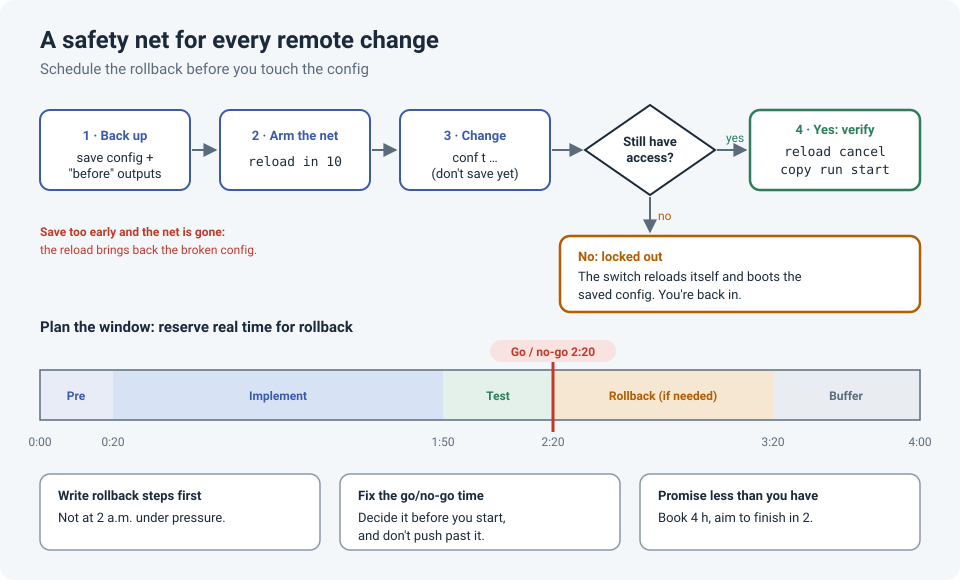

# Safe Changes on Remote Switches: Arm the Safety Net First

<!-- EDIT ME: open with the time "reload in" actually saved you: what you were changing,
     what locked you out, and how long you waited for the switch to come back.
     Keep names and companies out. -->

Changing a switch in the next room is easy: if you break it, you walk over with a console
cable. Changing a switch at a remote site is different. One wrong command on the uplink and
you've cut off your own access, along with everyone at that site, with nobody there who can
plug in a console.

These are the habits that keep remote changes boring.

!!! abstract "Key takeaway"
    Before touching a remote switch, **arm a safety net** with `reload in 10`. If you lock
    yourself out, the switch reboots into its saved config and you're back. **Don't save
    until you've verified.** And plan the change window conservatively: a fixed go/no-go
    time, a written rollback, and buffer for surprises.



## Safety net 1: `reload in`

```
copy running-config flash:pre-change.cfg     ! extra backup on the switch itself
reload in 10                                 ! reboot in 10 minutes unless cancelled
conf t
 ...your change...
end
! Can you still reach it? Test the things that matter.
reload cancel                                ! disarm the safety net
copy running-config startup-config           ! only now make it permanent
```

If the change locks you out, you just wait. Ten minutes later the switch reloads, boots the
**startup-config** (the last saved, working state), and you're back in.

!!! danger "The trap: saving too early"
    The safety net only works because the startup-config still holds the **old** config.
    If you run `copy run start` (or `wr mem`) before verifying, the reload brings back the
    **broken** config and the net is gone.

A few points worth knowing:

- **It's a full reboot**, so the site is down for a few minutes if it fires. That's still far
  better than a site that's down until someone drives there.
- **Pick a realistic timer.** Too short and it fires while you're still testing; too long and
  users wait longer if you lose access. 10–15 minutes suits most changes.
- **The gentler option on IOS-XE:** with `archive` configured, `configure terminal revert timer 10`
  rolls back only the config, without a reboot. Confirm a good change with `configure confirm`.

```
archive
 path flash:archive
!
configure terminal revert timer 10
 ...your change...
end
configure confirm                            ! stop the timer (this does NOT save)
copy running-config startup-config           ! save once you're happy
```

The revert timer isn't available everywhere (NX-OS, for example, uses
`configure replace ... commit-timeout` instead), and some IOS-XE versions have had bugs with
it, so try it in a lab first. Many engineers arm **both**: a short revert timer, plus a
longer `reload in` as a last resort in case the revert itself fails.

## The one-word outage: the missing `add`

The most common way to cut off a remote site isn't exotic. It's one missing word on a trunk:

```
switchport trunk allowed vlan add 30     ! appends VLAN 30 to the allowed list
switchport trunk allowed vlan 30         ! REPLACES the list: only VLAN 30 now passes
```

On an uplink, the second line silently removes the management VLAN and every user VLAN.
Your SSH session freezes mid-command, which is exactly where `reload in` saves you.

!!! tip "Before and after every trunk change"
    ```
    show interfaces trunk
    show running-config interface Gi1/0/48
    ```
    Compare the allowed-VLAN list before and after. If it got shorter, you forgot `add`.

## Plan the window conservatively

The command-level safety net protects the session. The change window protects the whole
change. Here's an example of a 4-hour window:

| Phase | Time | What happens |
|---|---|---|
| Pre-checks | 0:00–0:20 | Back up configs, capture "before" outputs (neighbors, routes, trunks) |
| Implement | 0:20–1:50 | The planned change |
| Test | 1:50–2:20 | Compare against the "before" outputs; users test key apps |
| **Go / no-go** | **2:20** | **Decided before the window starts.** Not working? Roll back. |
| Rollback | 2:20–3:20 | Rollbacks often take longer than expected |
| Buffer | 3:20–4:00 | For the surprises |

Rules of thumb:

- **Write the rollback steps before the window**, and check that they actually work.
  Improvising a rollback under pressure at 2 a.m. is how a second mistake happens.
- **Set the go/no-go time in advance and stick to it.** The urge to try "one more thing"
  past that point is how a change window turns into an outage.
- **Promise less than you have.** Book 4 hours, aim to finish in 2. Finishing early builds
  trust; overrunning damages it.

## Pre-change checklist

- [ ] Config backed up, off the device and on it (`copy run flash:`)
- [ ] "Before" outputs captured: `show ip route summary`, `show cdp neighbors`, `show interfaces trunk`, `show ip ospf neighbor`, etc.
- [ ] Rollback steps written down and reviewed
- [ ] Go / no-go time agreed
- [ ] `reload in` (or `revert timer`) armed before the first config command
- [ ] Out-of-band access checked, if the site has any (console server, LTE modem)
- [ ] Stakeholders told when the window starts and when to expect an update

## Lessons learned

!!! tip "Takeaways"
    - Arm the safety net **before** the first config command, every time.
    - **Verify, then save.** Never the other way around on a remote device.
    - On trunks, `add` is the most important word you'll type all day.
    - Be conservative with time: a fixed go/no-go and a real rollback window turn a bad night
      into a short one.

<!-- EDIT ME: add a short "What happened to me" section here: the change, the lockout,
     and how it felt to watch the switch come back. That's what makes this post yours. -->

## Reference

- Cisco Community: [Config change/modify best practices](https://community.cisco.com/t5/switching/config-change-modify-best-practices/m-p/2476451) (timed rollback with `configure replace`, `revert timer` and `configure confirm`)
