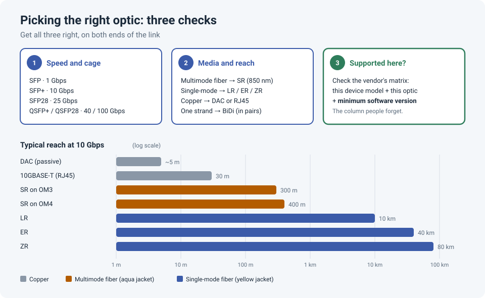

# SFPs Explained: Types, Reach, and How to Check Compatibility

<!-- EDIT ME: open with a real moment, e.g. an optic that arrived and didn't work, a link
     that came up at the wrong speed, or an "unsupported transceiver" message on install day.
     Keep names and companies out. -->

Optics look simple: a small module you push into a port. But "SFP" covers dozens of different
parts, and picking the wrong one is one of the most common reasons an install day goes
sideways. The link won't come up, comes up at the wrong speed, or the switch rejects the module
outright.

!!! abstract "Key takeaway"
    Choosing an optic comes down to three checks: the **speed and cage** (SFP, SFP+, SFP28,
    QSFP), the **media and reach** (multimode, single-mode, or copper, and how far), and
    whether it's **supported on this device and software version**. Check all three against
    the vendor's compatibility matrix *before* ordering, and make sure **both ends match**.



## Check 1: speed and cage

The **form factor** is the physical size of the module and the cage it fits in:

| Form factor | Speed | Typical use |
|---|---|---|
| SFP | 1 Gbps | Access switches, firewalls, older uplinks |
| SFP+ | 10 Gbps | Uplinks, servers, firewalls |
| SFP28 | 25 Gbps | Data center server access |
| QSFP+ / QSFP28 | 40 / 100 Gbps | Spine and core links |
| QSFP-DD / OSFP | 400 Gbps and up | Large data centers |

!!! warning "1 Gbps optics in 10 Gbps ports"
    Many SFP+ ports accept a 1 G SFP, but often **not automatically**. On many Cisco
    platforms you need `speed 1000` on the interface. Fortinet documents the same for the
    SFP+ ports on FortiGate 100F and 200F: the speed must be set to `1000full` rather than
    `auto`, and some 1 G copper SFPs aren't supported there at all. Always check before you
    rely on it.

## Check 2: media and reach

The **optic type** decides what cable it works with and how far it reaches. For 10 Gbps:

| Type | Media | Typical reach | Wavelength |
|---|---|---|---|
| **SR** | Multimode fiber | 300 m (OM3) / 400 m (OM4) | 850 nm |
| **LR** | Single-mode fiber | 10 km | 1310 nm |
| **ER** | Single-mode fiber | 40 km | 1550 nm |
| **ZR** | Single-mode fiber | 80 km | 1550 nm |
| **BiDi** | **One** fiber strand | Varies | Two wavelengths, sold in matched pairs |
| **DAC** | Twinax copper cable with modules attached | ~5 m passive | n/a |
| **AOC** | Fiber cable with modules attached | Up to ~100 m | n/a |
| **10GBASE-T** | RJ45 copper | 30 m | n/a, draws more power and runs hot |

Rules that save install days:

- **Both ends must match**: SR to SR, LR to LR. An SR on one end and an LR on the other won't
  link, and SR optics on single-mode fiber (or the other way round) give you a dead or flaky
  link.
- **BiDi optics come in pairs.** One end transmits at one wavelength (e.g. 1270 nm) and the
  other end at another (e.g. 1330 nm). Two *identical* BiDi optics can't talk to each other.
- **Match the fiber to the optic:** aqua jacket = multimode (SR), yellow jacket = single-mode
  (LR and beyond).
- **DAC is the cheapest option inside a rack**, but check that both devices support the
  specific cable, since DACs are the parts most often rejected by vendor checks.

## Check 3: is it supported on this device?

This is the step people skip, and it's the one that bites. Every major vendor publishes which
optics it has qualified on which devices.

### Cisco: the Optics-to-Device Compatibility Matrix

Cisco's matrix lives at **[tmgmatrix.cisco.com](https://tmgmatrix.cisco.com/)**. It tells you which
Cisco optics are fully qualified and supported on which Cisco switches, routers and servers.
There's also a sister tool, the **Optics-to-Optics Interoperability Matrix**, which tells you which
other optics or optical standards a given Cisco optic can talk to at the other end of a link.

How to use it:

1. **Search by device:** type your switch model (e.g. `C9300-48P` or `N9K-C93180YC-FX3`). You
   get every supported optic for that platform.
2. **Filter** by form factor, speed or reach to narrow the list.
3. **Read the minimum software column.** An optic can be "supported" and still not work if your
   switch runs older code. This is the column people forget.
4. **Or search by optic:** type a part number (e.g. `SFP-10G-SR`) to see every device that
   accepts it. That's useful when you're reusing optics from old hardware.

The matrix is the source of truth. A common real-world case: a team migrating to new Nexus
switches wanted to reuse their `SFP-10G-LRM` optics, but the matrix didn't list them for the
new platform. Community experts advised treating the matrix as authoritative and ordering
supported optics instead of gambling on install day.

### Fortinet

Fortinet publishes a **[Transceivers data sheet](https://www.fortinet.com/content/dam/fortinet/assets/data-sheets/Fortinet_Transceivers.pdf)**
listing its FortiGate and FortiSwitch optics and which models support them. Check the model
list for the exact optic part number, then check the firewall model's own data sheet and the
Fortinet community knowledge base for platform-specific caveats (like the 1 G speed setting on
the 100F/200F mentioned above).

### Palo Alto Networks

Palo Alto has a knowledge base article,
**[How to confirm if your SFP transceiver is supported by Palo Alto Networks firewall](https://knowledgebase.paloaltonetworks.com/articles/en_US/Knowledge/How-to-confirm-if-your-SFP-transceiver-is-supported-by-Palo-Alto-Networks-firewall)**,
which warns that an unsupported SFP can cause undesirable behaviour. Each PA-Series hardware
reference also lists the supported transceivers for that model.

## Third-party optics: allowed, but know the trade-off

Third-party ("compatible") optics are much cheaper and often work fine. But on Palo Alto, for
example, community experience is that only Palo Alto's own optics are **officially supported**,
because they've been qualified on the hardware. Third-party optics may work, but without vendor
support. Most vendors take the same position.

On Cisco, a third-party optic may be rejected with an "unsupported transceiver" error. Hidden
commands exist to allow it (`service unsupported-transceiver`), but they're unsupported, and TAC
may ask you to remove third-party optics before troubleshooting.

!!! tip "A practical rule"
    For critical links (core, uplinks, firewalls), use the vendor's own optics or ones the
    matrix lists. For lab and low-risk access links, quality third-party optics are a
    reasonable way to save money. Know which is which.

## Verify after installing

```
! Cisco IOS / IOS-XE
show inventory                                   ! part number and serial of each optic
show interfaces Te1/0/1 transceiver detail       ! DOM: Tx/Rx power, temperature, voltage
show interfaces status | include Te1/0/1         ! speed and type detected
```

```
# FortiGate
get system interface transceiver                 # vendor, part number and DOM per port
```

Reading the light levels: Rx power around **−40 dBm** means no light is arriving (wrong fiber,
swapped polarity, or a dead far end). For SR and LR optics, a healthy link usually sits
somewhere around **−1 to −10 dBm**; check the optic's data sheet for its exact range.

## Lessons learned

!!! tip "Takeaways"
    - Three checks: **speed and cage**, **media and reach**, **supported on this device and
      software**.
    - Check the vendor matrix **before ordering**, including the **minimum software version**.
    - Both ends must match, and **BiDi optics come in opposite pairs**.
    - Third-party optics save money but cost you vendor support. Choose deliberately.
    - After installing, **read the light levels**. They tell you more than "link up" does.

<!-- EDIT ME: add a short "What happened to me" section: an optic that didn't work, how you
     found out why, and what you order now. -->

## References

- Cisco: [Optics-to-Device Compatibility Matrix](https://tmgmatrix.cisco.com/) and [Optics-to-Optics Interoperability Matrix](https://tmgmatrix.cisco.com/iop)
- Fortinet: [Transceivers data sheet](https://www.fortinet.com/content/dam/fortinet/assets/data-sheets/Fortinet_Transceivers.pdf)
- Fortinet Community: [SFP transceiver support on FortiGate-100F and 200F SFP+ slots](https://community.fortinet.com/fortigate-3/technical-tip-sfp-transceiver-support-on-fortigate-100f-and-200f-sfp-slots-95363)
- Palo Alto Networks: [How to confirm if your SFP transceiver is supported](https://knowledgebase.paloaltonetworks.com/articles/en_US/Knowledge/How-to-confirm-if-your-SFP-transceiver-is-supported-by-Palo-Alto-Networks-firewall)
