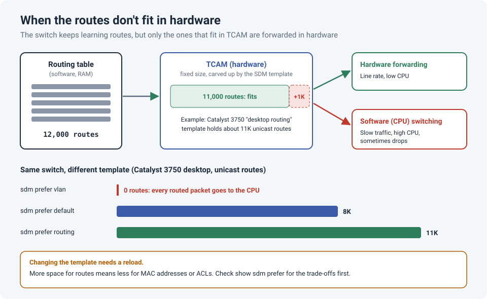

# Hitting the Route Limit on an Old Switch: TCAM and SDM Templates

An older Layer 3 switch starts behaving strangely: traffic between some networks gets slow,
the CPU runs high, and yet every route is in the routing table and nothing looks broken. The
switch hasn't failed. It has run out of space in the hardware table it uses to forward
packets quickly.

!!! abstract "Key takeaway"
    Switches forward in hardware using **TCAM**, a fixed-size table. On many Catalyst switches,
    an **SDM template** decides how that space is split between routes, MAC addresses, ACLs and
    so on. When the switch has more routes than its template allows, the extra routes are
    handled **in software by the CPU**: slow forwarding and high CPU. Check with
    `show sdm prefer` and `show platform tcam utilization`, then send the switch fewer routes,
    change the template (it needs a **reload**), or replace the hardware.



## How switches forward packets fast

A Layer 3 switch keeps its **routing table** in software (RAM), but it doesn't look up every
packet there. It programs the routes into **TCAM**, special memory that the switching hardware
can search at line rate. That's what makes a switch fast.

TCAM is **fixed in size**. On Catalyst switches such as the 3750 series, the **Switching
Database Manager (SDM)** manages what's stored in it, and **SDM templates** decide how the space
is divided between unicast routes, MAC addresses, multicast, ACLs and more.

Cisco's own example for the Catalyst 3750 desktop models:

| SDM template | Unicast routes |
|---|---|
| `vlan` | **0** (all space given to Layer 2) |
| `default` | about 8K |
| `routing` | about 11K |

The aggregator models (3750-12S) have larger templates. Other platforms have different
numbers, so always check your own switch.

## What happens when the routes don't fit

The switch doesn't refuse the routes. Cisco's documentation for the 3750 explains that it can
store considerably more routes **in software** than the SDM template allows, but it doesn't
recommend doing so, because **performance decreases and CPU utilization rises**.

In practice:

- Traffic to routes that made it into TCAM is forwarded in hardware, at full speed.
- Traffic to routes that didn't fit is **switched by the CPU**: slow, and competing with
  everything else the CPU does (routing protocols, management, spanning tree).
- Only *some* destinations are affected, which makes it confusing to troubleshoot.

!!! danger "The VLAN template trap"
    The `vlan` template gives **zero** space to unicast routes. If a switch doing inter-VLAN
    routing ends up on that template, every routed packet goes to the CPU. One Cisco
    community case showed exactly that: slow VLAN-to-VLAN traffic on a 3750 running the
    "desktop vlan" template.

## How to check

```
show sdm prefer                        ! current template and its limits
show ip route summary                  ! how many routes you actually have
show platform tcam utilization         ! used/maximum per TCAM region
show processes cpu sorted              ! is the CPU busy forwarding traffic?
show logging | include TCAM            ! TCAM-related warnings
```

`show platform tcam utilization` shows each region as **used/maximum**, for example:

```
IPv4 unicast indirectly-connected routes:  1040/8320
```

If the used number is at or near the maximum, you've found it.

## Fixing it

**1. Send the switch fewer routes.** Often the best fix: does a campus or distribution switch
really need every specific route? Summarize where you can, filter what it learns, or give it a
default route plus a handful of summaries. A full Internet routing table, for example, is far
beyond what any old campus switch can hold in hardware.

**2. Change the SDM template.**

```
configure terminal
 sdm prefer routing
end
show sdm prefer          ! shows the current template AND the one active after reload
reload                   ! required: the new template only applies after a reload
```

!!! warning "Templates are a trade-off"
    More space for routes means **less** for something else, such as MAC addresses or ACL
    entries. Compare the templates with `show sdm prefer <template-name>` before switching,
    so you don't fix routing by breaking something else.

!!! info "Stacks must match"
    In a stack, every member runs the same template. Cisco's documentation shows that adding
    a switch that can't run the stack's current template produces an SDM mismatch, and the
    new member won't work until the template is changed and the stack reloaded.

**3. Replace the hardware.** If the network has simply outgrown the switch, no template will
save it. Newer platforms have far larger tables, and routing at the edge of a network belongs
on a proper router.

## Lessons learned

!!! tip "Takeaways"
    - Hardware tables have **hard limits**. Software tables don't, which is why everything
      *looks* fine.
    - Over the limit, traffic is **CPU-switched**: slow, high CPU, and only for some
      destinations.
    - Check the template **before** adding lots of routes to an old switch.
    - Changing the SDM template needs a **reload** and trades off other resources.
    - The cleanest fix is often to send the switch **fewer routes**.

## References

- Cisco: [Understanding and Configuring Switching Database Manager on Catalyst 3750 Series Switches](https://www.cisco.com/c/en/us/support/docs/switches/catalyst-3750-series-switches/44921-swdatabase-3750ss-44921.html)
- Cisco Community: [High CPU on 3750, TCAM Full](https://community.cisco.com/t5/switching/high-cpu-on-3750-tcam-full/td-p/1071086)
- Cisco Community: [Low bandwidth on 3750 from VLAN to VLAN](https://community.cisco.com/t5/switching/low-bandwith-on-3750-from-vlan-to-vlan/m-p/2124093)
