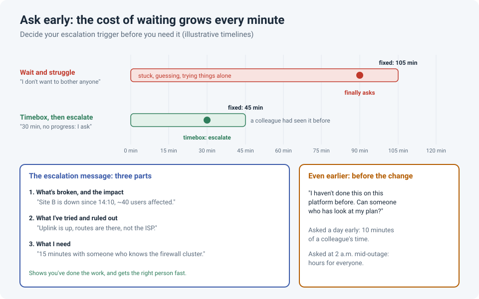

# Ask Early: Why Escalating Sooner Saves Everyone Time

Most of us have done it: stuck on a problem, sure the answer is one more command away, not
wanting to bother anyone. Thirty minutes becomes an hour, then two. When we finally ask, a
colleague who has seen it before solves it in ten minutes.

The fix isn't more willpower. It's deciding **in advance** when and how you'll ask, so that
asking is just following the process, not admitting defeat.

!!! abstract "Key takeaway"
    Ask for help **early**: before a change on a platform you don't know well, and during an
    incident as soon as you hit your **timebox** (for example, 30 minutes without progress).
    Research shows people are much **more willing to help** than we expect, and asking for
    advice can make you look **more** competent, not less. A three-part escalation message
    gets you the right help, fast.

## Why we wait too long

It's not just shyness. Two well-known research findings explain a lot of it.

**We underestimate how willing people are to help.** In a series of studies, Flynn and Lake
(2008) asked participants to predict how many people they'd need to ask before enough of
them agreed to help, then sent them out to actually ask. Participants consistently
**overestimated by around 50%** how many people they'd need to ask. The researchers found
the cause: help-seekers focus on the cost of saying **yes** (the helper's time and effort),
and underestimate how uncomfortable it is for people to say **no**.

**We worry that asking makes us look less competent.** Brooks, Gino and Schweitzer (2015)
found the opposite: people who **asked for advice** were seen as **more** competent, especially
when the task was difficult and they asked the person whose advice they wanted. Asking a
colleague "you know this platform better than I do, what would you check?" usually lands as a
compliment.

## Before the change: ask while it's cheap

Some knowledge is purely platform-specific: a quirk of one firewall's HA, a known bug in one
software version, a setting with an unexpected default. Someone who has done it before can
spot it in minutes.

So before a change on a platform or feature you haven't touched before:

- **Say it out loud:** "I haven't done this on this platform before. Can someone who has look
  at my plan?"
- **Tell your manager early** if you think you might need help during the window. It's much
  easier to line up support a day in advance than at 2 a.m.
- **There's no shame in it.** Nobody knows every platform. Asking for a review is a sign of a
  careful engineer.

Asked a day early, a plan review costs a colleague ten minutes. The same question in the
middle of an outage costs everyone hours.

## During an incident: timebox, then escalate

In the moment, stress makes it hard to judge whether you're "nearly there". So take the
decision out of the moment:

!!! tip "The timebox rule"
    Before you start troubleshooting, set a limit: **if I've made no real progress in 30
    minutes, I escalate.** Pick a number that fits the impact: shorter for a site outage,
    longer for a minor issue. When the timer goes off, you escalate. No debate, no guilt.

Pair it with an **internal process you can trust when things get chaotic**:

- A clear **escalation path**: who to call, in what order, and how (phone, chat, on-call tool).
- An up-to-date **contact list** for vendors and specialist teams, with support contract numbers.
- Agreement in the team that **escalating early is expected**, not a failure.

When everything is on fire, you don't want to be deciding who to call. You want to follow a
plan you already trust.

## The escalation message: three parts

A good escalation message gets you the right help quickly and shows you've done the work:

| Part | Example |
|---|---|
| **1. What's broken, and the impact** | "Site B has been down since 14:10, about 40 users affected." |
| **2. What I've tried and ruled out** | "The uplink is up, the routes are there, and it's not the ISP." |
| **3. What I need** | "15 minutes with someone who knows the firewall cluster." |

Part 2 matters most. It saves the helper from repeating your work, and every ruled-out cause
is real progress, even if the problem isn't fixed yet.

## For team leads: make asking safe

People escalate early only if it's safe to do so:

- **Thank people for escalating,** especially early ones that turn out to be simple. The
  alternative is people sitting on problems.
- **Never punish an early escalation** with "you should have known that". That's how you teach
  people to wait.
- **Ask "what" and "how", not "who".** A blameless culture is what makes asking for help feel
  safe (see [When Something Breaks, Ask "What" and "How"](process-not-people.md)).

## How strong is the evidence?

| Claim | Source | Evidence strength |
|---|---|---|
| People underestimate how willing others are to help, by roughly half | Flynn & Lake, 2008 (*JPSP*) | **Moderate to strong.** Six studies with real requests in real settings, and the finding has been extended by later research |
| The bias comes from underestimating how hard it is for others to say "no" | Flynn & Lake, 2008 | **Moderate.** Tested directly in the same paper |
| Asking for advice can increase how competent you seem | Brooks, Gino & Schweitzer, 2015 | **Moderate.** Several experiments; the effect was strongest for difficult tasks and when the person asked was the advisor |
| A timebox and escalation path reduce outage time | Common practice in incident management | **Practical experience** rather than controlled studies |

## References

- Flynn, F. J., & Lake, V. K. B. (2008). [If you need help, just ask: Underestimating compliance with direct requests for help](https://doi.org/10.1037/0022-3514.95.1.128). *Journal of Personality and Social Psychology*, 95(1), 128–143.
- Brooks, A. W., Gino, F., & Schweitzer, M. E. (2015). Smart people ask for (my) advice: Seeking advice boosts perceptions of competence. *Management Science*, 61(6), 1421–1435.
- Stanford Graduate School of Business: [Francis Flynn: If You Want Something, Ask For It](https://www.gsb.stanford.edu/insights/francis-flynn-if-you-want-something-ask-it)
