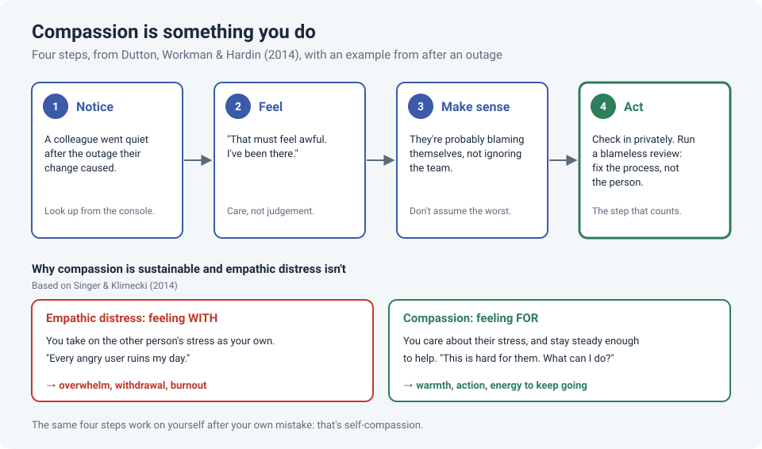

# Compassion at Work: Notice, Feel, Make Sense, Act

IT work is full of other people's bad days. A user is about to miss a deadline. A colleague's
change just took down a site. And sometimes the bad day is ours. How we respond in those
moments shapes the team far more than any config.

Compassion sounds soft, but researchers describe it as something very practical: a short
process that ends in **action**.

!!! abstract "Key takeaway"
    Compassion is four steps: **notice** someone is struggling, **feel** concern for them,
    **make sense** of what's going on without assuming the worst, and **act** to help. It
    differs from absorbing other people's stress (*empathic distress*), which drains you.
    Compassion keeps you steady enough to help, and the same steps work on yourself after a
    mistake.

## The four steps

Dutton, Workman and Hardin (2014) reviewed the research on compassion in organizations and
describe it as a process with four parts. Here's what each looks like in IT:

| Step | What it means | In IT |
|---|---|---|
| **1. Notice** | See that someone is struggling | The colleague who went quiet after the outage. The user whose "quick question" email is their third today. |
| **2. Feel** | Feel concern for them, not judgement | "That must feel awful. I've been there." |
| **3. Make sense** | Interpret the situation generously | They're probably blaming themselves, not ignoring the team. The angry user is likely under pressure from *their* boss. |
| **4. Act** | Do something to help | Check in privately. Offer to pair on the fix. Give the user a realistic timeline. |

Step 4 is the one that counts. Feeling bad for someone without acting doesn't help them,
and sometimes it doesn't help you either.

## Empathy vs. compassion: why it matters for burnout

Singer and Klimecki (2014) separate two responses to someone else's suffering:

- **Empathic distress (feeling *with*):** you take on their stress as your own. Every angry
  user ruins your day. Over time this leads to overwhelm and withdrawal, the road to burnout.
- **Compassion (feeling *for*):** you care about their stress, but stay steady enough to help.
  In their research, compassion training was linked to more positive feelings, not fewer.

For support and on-call work, this is a big deal. You can't stop caring about users, but you
can care *about* them without carrying their stress home.

## Compassion toward users

- When a user is short with you, run step 3 before you react: what pressure might they be under?
- Name the impact on them ("you've lost your work twice"). See
  [Making a User Feel Heard](feel-heard.md).
- Don't leave them in silence. See [The First Touch](first-touch-ticket-stress.md).

## Compassion toward colleagues: blameless reviews

The most practical form of team compassion in our field is the **blameless postmortem**,
popularized by Google's Site Reliability Engineering book. After an incident, the review asks
*what in the process allowed this to happen*, not *who did it*. People who aren't afraid of
blame report problems earlier and share what actually happened, which makes the fix better.

!!! tip "After an outage someone caused"
    - Check in privately first: "Rough day. You OK?"
    - In the review, talk about the change process, the missing check, the unclear runbook.
    - Leave out names unless they're needed for the timeline.

## Compassion toward yourself

The same four steps apply when *you* made the mistake: notice you're beating yourself up,
treat yourself the way you'd treat a colleague in the same spot, make sense of how it
happened, then act on the lesson.

This isn't letting yourself off the hook. In experiments by Breines and Chen (2012), people
encouraged to be self-compassionate after a failure were **more** motivated to improve: for
example, they spent longer studying for a retest. Harsh self-criticism tends to make people
avoid the mistake rather than learn from it.

## How strong is the evidence?

| Claim | Source | Evidence strength |
|---|---|---|
| Compassion at work is a process: notice, feel, make sense, act | Dutton, Workman & Hardin, 2014 (review) | **Moderate.** A well-cited review; it's a framework that organizes the research rather than a single test of it |
| Experiencing compassion at work is linked to positive emotion and commitment | Lilius et al., 2008 | **Moderate to weak.** Survey-based and correlational, so it shows a link, not cause and effect |
| Compassion differs from empathic distress and supports wellbeing | Singer & Klimecki, 2014 | **Moderate.** Lab and training studies including brain imaging, but mostly short-term and from one research program |
| Self-compassion after failure increases motivation to improve | Breines & Chen, 2012 | **Moderate.** Several experiments, mostly with university students in lab settings |

## References

- Breines, J. G., & Chen, S. (2012). Self-compassion increases self-improvement motivation. *Personality and Social Psychology Bulletin*, 38(9), 1133–1143.
- Dutton, J. E., Workman, K. M., & Hardin, A. E. (2014). Compassion at work. *Annual Review of Organizational Psychology and Organizational Behavior*, 1, 277–304.
- Lilius, J. M., Worline, M. C., Maitlis, S., Kanov, J., Dutton, J. E., & Frost, P. (2008). The contours and consequences of compassion at work. *Journal of Organizational Behavior*, 29(2), 193–218.
- Singer, T., & Klimecki, O. M. (2014). Empathy and compassion. *Current Biology*, 24(18), R875–R878.
- Beyer, B., Jones, C., Petoff, J., & Murphy, N. R. (Eds.) (2016). [Postmortem Culture: Learning from Failure](https://sre.google/sre-book/postmortem-culture/). In *Site Reliability Engineering*. O'Reilly.
