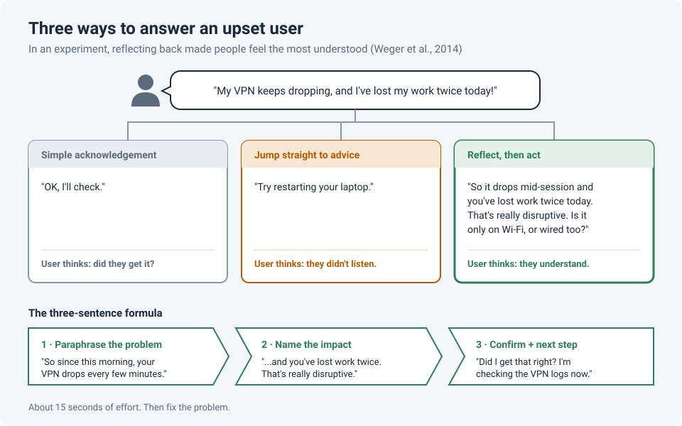

# Making a User Feel Heard in a Few Sentences

<!-- EDIT ME: open with a real moment, e.g. a user who was angry on the phone and calmed
     down once you repeated their problem back. Keep names and companies out. -->

When a user reaches out upset, our instinct as engineers is to go straight to the fix. That's
the part we're good at. But the user doesn't know yet whether we've understood the problem,
and until they do, every question we ask can feel like we're not listening.

There's a short step that changes the whole conversation: **say their problem back to them
before you start fixing it.**

!!! abstract "Key takeaway"
    Use three short sentences: **paraphrase the problem**, **name the impact**, then **confirm
    and say your next step**. It takes about 15 seconds. In a controlled experiment, people who
    got this kind of response felt more understood than people who got a simple "OK" or
    straight advice.

## Three ways to answer

Take this message: *"My VPN keeps dropping, and I've lost my work twice today!"*

| Response type | Example | What the user hears |
|---|---|---|
| Simple acknowledgement | "OK, I'll check." | Did they even get what's wrong? |
| Straight to advice | "Try restarting your laptop." | They skipped over my problem. |
| **Reflect, then act** | "So it drops mid-session and you've lost work twice today. That's really disruptive. Is it only on Wi-Fi, or wired too?" | **They understand.** |

The third one isn't softer or slower. It still ends with a sharp troubleshooting question.
The difference is that the user now trusts the question comes from someone who understood.

## The three-sentence formula

### 1. Paraphrase the problem

Repeat the facts in your own words, not word for word.

> "So since this morning, your VPN drops every few minutes."

This does two jobs at once: the user feels heard, and **you catch misunderstandings early**.
If you got it wrong, they'll correct you now instead of after an hour of troubleshooting the
wrong thing.

### 2. Name the impact

Say what the problem is costing them, using what they told you.

> "...and you've lost your work twice. That's really disruptive."

Users rarely care about the VPN. They care about the lost work, the missed meeting, the client
waiting. Naming that shows you understand why it matters.

### 3. Confirm and give the next step

> "Did I get that right? I'm checking the VPN logs now."

The question gives them a chance to correct you; the next step shows that action is starting.

## Pitfalls

- **Don't use canned empathy.** "I understand your frustration" is the phrase everyone has
  learned to ignore. Naming the *specific* impact ("you've lost work twice") is what lands.
- **Don't parrot.** Repeating their exact words sounds robotic. Paraphrase.
- **Don't debate blame.** "Well, the VPN works for everyone else" may be true, but it tells
  the user they're the problem. Gather the facts first.
- **Keep it short.** This is three sentences, not a therapy session. Then fix the problem.
- **It works in writing too.** The same three sentences make a great first reply to a ticket,
  and they pair well with [The First Touch](first-touch-ticket-stress.md).

## How strong is the evidence?

| Claim | Source | Evidence strength |
|---|---|---|
| Paraphrasing (active listening) makes people feel more understood than simple acknowledgements or advice | Weger et al., 2014 | **Moderate.** A controlled experiment with 115 participants, but short conversations between university students. Notably, advice and active listening scored about the same on *overall satisfaction*, so advice isn't wrong; it just works better *after* the person feels understood |
| Being listened to at work is linked to trust, performance and well-being | Kluger & Itzchakov, 2022 (review) | **Moderate.** A broad review across many fields, but much of the evidence is correlational, with fewer controlled experiments |

<!-- EDIT ME: close with one line from your own experience, e.g. how a tense call turned
     around after you paraphrased the problem. -->

## References

- Weger, H., Castle Bell, G., Minei, E. M., & Robinson, M. C. (2014). [The relative effectiveness of active listening in initial interactions](https://doi.org/10.1080/10904018.2013.813234). *International Journal of Listening*, 28(1), 13–31.
- Kluger, A. N., & Itzchakov, G. (2022). [The power of listening at work](https://doi.org/10.1146/annurev-orgpsych-012420-091013). *Annual Review of Organizational Psychology and Organizational Behavior*, 9, 121–146.
