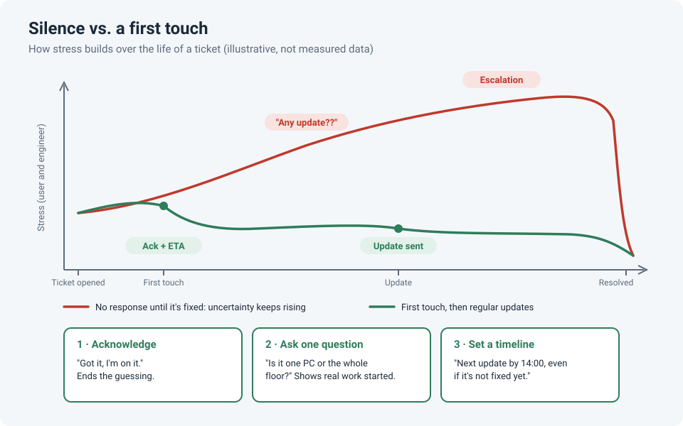

# The First Touch: Why a Quick Reply Lowers Everyone's Stress

Every engineer knows the feeling: the queue is full, a ticket has been sitting there for a
while, and you haven't had time to touch it. Two people are stressed about that ticket. The
user is wondering whether anyone has even seen it. And you're carrying it in the back of
your head while you work on something else.

The fix for both is surprisingly small: **send the first touch.** Not the fix. Just a message.

!!! abstract "Key takeaway"
    Waiting itself isn't the worst part; **not knowing** is. A short acknowledgement, one
    specific question, or a time for the next update removes that uncertainty for the user.
    It also helps *you*: once a task has a concrete plan attached, it stops nagging at you.

## Why waiting hurts: it's the uncertainty

In a 2016 study at UCL, participants learned to predict whether they'd receive a mildly
painful electric shock. Stress (self-reported, plus sweat and pupil size) was **highest when
the odds were 50/50**, and lowest when a shock was certain *or* certainly not coming. In other
words, people found **not knowing** more stressful than knowing that something unpleasant
was definitely coming.

A user waiting on a silent ticket is in that 50/50 zone: *Did anyone see it? Is it being worked
on? Should I chase it? Should I escalate?* Every one of those questions is uncertainty you can
remove with a single sentence.

David Maister made the same point about queues decades earlier: **unexplained** and
**uncertain** waits feel longer than explained, bounded ones. A ticket queue is just a
waiting line that the customer can't see.

## Why it helps you too

Unfinished tasks tend to keep popping back into your mind (the *Zeigarnik effect*). In a
2011 series of experiments, Masicampo and Baumeister found that this background nagging
dropped away once people made a **specific plan** for the unfinished task, even though they
hadn't done the task yet.

Sending the first touch *is* making that plan. "I'll check the switch port at 13:00 and update
you by 14:00" turns an open loop into a scheduled one, for the user and for your own head.

## The three moves

### 1. Acknowledge

The minimum. It answers "did anyone see this?"

!!! example "Template"
    Hi Sara, got your ticket about the printer on floor 3. I'm on it and will update you
    by 14:00 today.

### 2. Ask one specific question

Shows that real work has started, and often saves you an hour of guessing.

!!! example "Template"
    Quick question so I look in the right place: is it only your laptop, or are others
    near you affected too?

### 3. Set a timeline

Promise **the next update**, not the fix. You control the first; you often don't control the second.

!!! example "Template"
    No fix yet: I've ruled out the switch port and I'm checking the DHCP scope next.
    Next update by 16:00.

That last example also uses a core troubleshooting idea: every ruled-out cause is
progress, and telling the user about it turns "still broken" into "getting closer".

## Rules of thumb

- **Promise the next update time, not the resolution time.** Then keep it, even if the
  update is "no change yet".
- **Be specific.** "I'm checking the switch port your PC is on" builds more trust than "we're
  working on it".
- **A human sentence beats an auto-reply.** An automatic "ticket received" email is better
  than nothing, but a one-line personal message shows someone actually read it.
- **Underpromise.** Give yourself a buffer on timelines; delivering early feels great,
  delivering late erases the goodwill you built.
- **Do the first touch in batches.** Five minutes at the start of the day to send a first
  touch on every new ticket clears both your mind and the users' worries.

## How strong is the evidence?

| Claim | Source | Evidence strength |
|---|---|---|
| Uncertainty is more stressful than a certain bad outcome | de Berker et al., 2016 (*Nature Communications*) | **Moderate.** Well-designed lab study with physiological measures, but a single study with a lab stressor |
| Unexplained, uncertain waits feel longer | Maister, 1985 | **Weak to moderate.** Influential practitioner framework, not a controlled experiment |
| A specific plan quiets thoughts about unfinished tasks | Masicampo & Baumeister, 2011 (*JPSP*) | **Promising, not settled.** Several experiments, but from one lab with student samples; treat it as a useful idea rather than a proven law |

The practical advice doesn't depend on any one of these being perfect: a short, honest
message costs almost nothing, and the downside of silence is easy to see in any ticket queue.

## References

- de Berker, A. O. et al. (2016). [Computations of uncertainty mediate acute stress responses in humans](https://doi.org/10.1038/ncomms10996). *Nature Communications*, 7, 10996.
- Maister, D. H. (1985). The Psychology of Waiting Lines. In *The Service Encounter*. Lexington Books.
- Masicampo, E. J., & Baumeister, R. F. (2011). [Consider it done! Plan making can eliminate the cognitive effects of unfulfilled goals](https://doi.org/10.1037/a0024192). *Journal of Personality and Social Psychology*, 101(4), 667–683.
