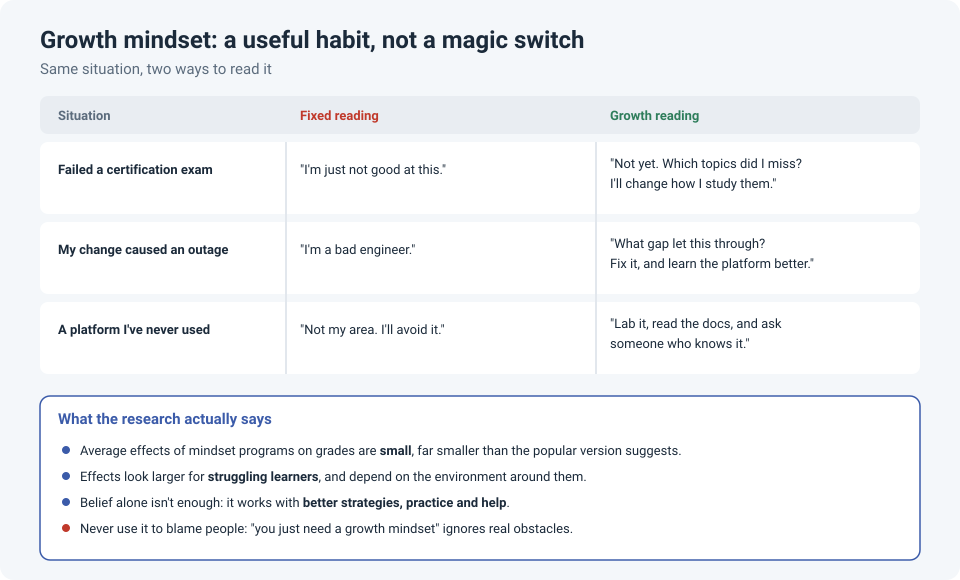

# Growth Mindset for Engineers: Useful Habit, Oversold Promise

Network engineering is a career of constantly being a beginner again: a new vendor, a new
platform, a new certification, a new way an outage can happen. How you interpret those
moments shapes whether you lean in or back away.

That's the idea behind **growth mindset**, from psychologist Carol Dweck: the belief that your
abilities can be developed through effort, good strategies and help from others, rather than
being fixed. It's one of the most popular ideas in psychology. It's also one of the most
debated, and the honest version is more useful than the hype.

!!! abstract "Key takeaway"
    Treating skills as something you build, not something you have, is a genuinely useful
    habit for engineers: failed exams become "not yet", outages become lessons, unfamiliar
    platforms become things to learn. But large studies show the effects of growth mindset
    programs are **small** on average, larger for people who are struggling, and they depend on
    the environment. Belief alone does little; it works alongside **better strategies,
    practice and support**.

## Fixed vs. growth, in engineering terms

| Situation | Fixed reading | Growth reading |
|---|---|---|
| Failed a certification exam | "I'm just not good at this." | "Not yet. Which topics did I miss? I'll change how I study them." |
| My change caused an outage | "I'm a bad engineer." | "What gap let this through? Fix it, and learn the platform better." |
| A platform I've never used | "Not my area. I'll avoid it." | "Lab it, read the docs, and ask someone who knows it." |
| A colleague knows far more than me | "I'll never be that good." | "What can I learn from how they work?" |

The growth reading isn't about positive thinking. Each one ends with an **action**: a
different study method, a process fix, a lab, a question. That's the part that matters.

## What the research actually says

Growth mindset became hugely popular, and then it was tested at scale. The results are more
modest than the popular version:

- **The link is weak.** In a 2018 pair of meta-analyses, Sisk and colleagues found only a weak
  relationship between students' mindsets and their grades, and the average effect of mindset
  programs was very small. Later meta-analyses by Macnamara and Burgoyne found similarly small
  effects, and smaller still when only the most rigorous studies were included.
- **But it isn't nothing.** In a large national experiment published in *Nature* in 2019,
  Yeager and colleagues found that a short online growth mindset program improved grades for
  **lower-achieving** students, with effects that depended on the school environment, for
  example whether peers supported taking on challenges.
- **The debate has matured.** Both sides now largely agree the real question isn't "does it
  work?" but "**for whom, and under what conditions?**"

Dweck herself warns about a "**false growth mindset**": praising effort alone, even when
someone is stuck. Effort without a better strategy just means working hard at the wrong thing.

## What actually helps

Given that evidence, here's how to use the idea without overselling it:

- **Pair "not yet" with a new strategy.** Failing an exam and studying the same way again isn't
  growth mindset. Change the method, for example with retrieval practice and labs instead of
  re-reading.
- **Treat mistakes as information.** After an outage, the useful question is "what can I learn
  and fix?", not "what does this say about me?" It's the same idea as asking **what** and
  **how** instead of **who** (see [When Something Breaks, Ask "What" and "How"](process-not-people.md)).
- **Seek out the hard work on purpose.** Volunteer for the unfamiliar platform. Lab the protocol
  you're weakest at. Discomfort is usually where the learning is.
- **Get help early.** Growth comes from good input, not just effort. Asking someone who knows a
  platform is the fastest way to grow on it (see [Ask Early](ask-for-help-early.md)).
- **Praise the process specifically.** "The way you traced that through the MAC tables was
  smart" helps a colleague more than "you're a natural".

!!! warning "Don't turn it into blame"
    "You just need a growth mindset" is not feedback. If someone is struggling, look at what
    they need: training, time, a mentor, a lab, a better process. Mindset is one ingredient,
    not a substitute for support.

## How strong is the evidence?

| Claim | Source | Evidence strength |
|---|---|---|
| Mindset is only weakly linked to academic achievement | Sisk et al., 2018 (two meta-analyses) | **Strong** evidence that the link is **small** |
| Mindset programs have small average effects, smaller in the most rigorous studies | Sisk et al., 2018; Macnamara & Burgoyne, 2022 | **Strong** evidence that average effects are **small** |
| A short program improved grades for lower-achieving students, depending on context | Yeager et al., 2019 (*Nature*) | **Moderate to strong.** Large, nationally representative, pre-registered; effects were small and varied by school |
| Growth mindset at work | Few direct studies | **Limited.** Most evidence comes from schools; applying it to workplaces is reasonable but less tested |

## References

- Dweck, C. S. (2006). *Mindset: The New Psychology of Success*. Random House.
- Sisk, V. F., Burgoyne, A. P., Sun, J., Butler, J. L., & Macnamara, B. N. (2018). [To what extent and under which circumstances are growth mind-sets important to academic achievement? Two meta-analyses](https://doi.org/10.1177/0956797617739704). *Psychological Science*, 29(4), 549–571.
- Yeager, D. S., Hanselman, P., Walton, G. M., et al. (2019). [A national experiment reveals where a growth mindset improves achievement](https://doi.org/10.1038/s41586-019-1466-y). *Nature*, 573, 364–369.
- Macnamara, B. N., & Burgoyne, A. P. (2022). Do growth mindset interventions impact students' academic achievement? A systematic review and meta-analysis with recommendations for best practices. *Psychological Bulletin*.
- Yeager, D. S., & Dweck, C. S. (2020). [What can be learned from growth mindset controversies?](https://pmc.ncbi.nlm.nih.gov/articles/PMC8299535) *American Psychologist*, 75(9), 1269–1284.
