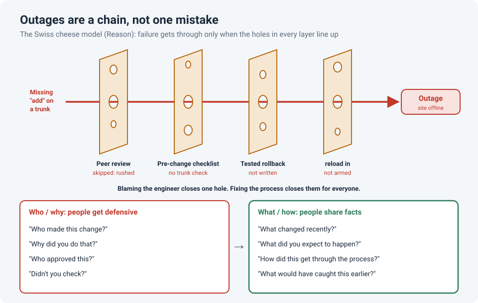

# When Something Breaks, Ask "What" and "How", Not "Who"

<!-- EDIT ME: open with a real moment, e.g. an incident call where someone asked "who did
     this?" and the room went quiet, or one where a good question opened things up.
     Keep names and companies out. -->

When something breaks, the first question in the room is often "**who** made this change?"
It's a natural reaction. But the moment people hear it, they get defensive: they start
protecting themselves instead of sharing what actually happened. And what actually happened
is exactly what you need to fix the problem.

The fix is simple: change the question.

!!! abstract "Key takeaway"
    Serious failures are almost never one person's mistake. They're a **chain** of small
    gaps that happened to line up, which is what safety science calls the **Swiss cheese
    model**. Ask **what** and **how** questions ("what changed?", "how did this get through?")
    instead of **who** and **why**. People keep sharing facts, you find the cause faster, and
    you fix the process so it can't happen to anyone else.

## Plane crashes are a chain, and so are outages

In 1977, two Boeing 747s collided on a foggy runway at Tenerife, killing 583 people. It's
still the deadliest accident in aviation history. And it wasn't caused by one mistake. It
took a chain of them:

- A bomb threat at another airport diverted both planes to a small, crowded one.
- Thick fog meant the crews couldn't see each other on the runway.
- The KLM crew were under pressure from duty-time limits.
- Non-standard radio phrases made a takeoff sound like a position report.
- Two transmissions overlapped, blocking the critical warning.
- The flight engineer voiced a doubt, but it was brushed aside.

Remove **any one** of those links and the crash probably doesn't happen. Aviation's response
wasn't to blame one pilot. It was to change the **system**: standard radio phrases, and
**crew resource management** training, which teaches crews to speak up and to listen when a
colleague raises a concern.

## The Swiss cheese model

Psychologist James Reason described this as the **Swiss cheese model**. Every organization
has layers of defence: training, procedures, checklists, reviews, alarms. Each layer is a
slice of cheese, and each slice has **holes**: gaps that come from time pressure, unclear
procedures or missing tools. Most of the time, a hole in one slice is blocked by the next one.
An accident only happens when the holes in **every** slice line up.

Network outages work the same way. A site goes offline because:

| Layer | The hole |
|---|---|
| Peer review | Skipped, because the change was "small" and everyone was busy |
| Pre-change checklist | Didn't include checking the trunk's allowed VLANs |
| Rollback plan | Not written down |
| `reload in` safety net | Not armed |
| The final step | Someone forgot the `add` keyword on a trunk |

Blame the engineer who forgot `add`, and you've closed **one** hole, for one person. Fix
the checklist, make peer review mandatory for uplinks, and make `reload in` standard, and
you've closed the holes **for everyone**. (See
[Safe Changes on Remote Switches](../field-stories/safe-remote-changes.md) for those safeguards.)

## Change the question

| Puts people on edge | Gets you the facts |
|---|---|
| "Who made this change?" | "What changed recently?" |
| "Why did you do that?" | "What did you expect to happen when you ran it?" |
| "Who approved this?" | "How did this get through the change process?" |
| "Didn't you check?" | "What would have helped us catch this earlier?" |

"**Why**" questions sound like a request for justification, so people defend themselves.
"**What**" and "**how**" questions point at the situation and the system, so people describe
what they saw. That description is your best troubleshooting data.

John Allspaw, who led engineering operations at Etsy, made the same point in his essay
*The Infinite Hows*: asking "how" again and again uncovers the many conditions behind an
incident, where chasing a single "why" tends to stop at the nearest person.

## During the incident and after

**During the incident:**

- Ask "what changed?" first, not "who changed it?". You need the facts, fast.
- Thank people for speaking up, especially the person who says "I think it was my change".
  That's the most valuable sentence in any outage call.
- Keep the focus on restoring service. The review comes later.

**In the review afterwards:**

- Build a **timeline** of what happened, using facts and timestamps.
- For each step, ask **how** it was possible: what was missing, unclear or rushed?
- Turn each hole into an **action**: update the checklist, add a review step, automate a check.
- Leave names out of the write-up unless they're needed for the timeline.

!!! warning "Blameless doesn't mean accountability-free"
    People are still responsible for their work, and repeated, deliberate carelessness is
    still a management conversation. Blameless means that **honest mistakes** in a flawed
    system are treated as information about the system, not as a reason to punish someone.

## How strong is the evidence?

| Claim | Source | Evidence strength |
|---|---|---|
| Accidents result from multiple aligned failures across layers of defence | Reason, 1990; Reason, 2000 | **Widely used model**, foundational in aviation and healthcare safety. It's a framework, not an experiment, and critics note it can oversimplify how failures interact |
| Teams where people feel safe to speak up learn more from mistakes | Edmondson, 1999 | **Moderate to strong.** A field study of 51 work teams, supported by many later studies; much of the evidence is correlational |
| Better-run teams may *report* more errors, because people feel safe to admit them | Edmondson, 1996 | **Moderate.** A hospital study; the finding has been influential, but it comes from a specific setting |
| Changing the system (procedures, training) improves safety after accidents | Aviation's adoption of crew resource management | **Strong in practice**, widely adopted after Tenerife and later accidents, though isolating its exact effect is difficult |

<!-- EDIT ME: close with one line from your own experience, e.g. how an incident review
     changed once the questions moved from "who" to "how". -->

## References

- Reason, J. (1990). *Human Error*. Cambridge University Press.
- Reason, J. (2000). [Human error: models and management](https://doi.org/10.1136/bmj.320.7237.768). *BMJ*, 320(7237), 768–770.
- Edmondson, A. (1999). Psychological safety and learning behavior in work teams. *Administrative Science Quarterly*, 44(2), 350–383.
- Edmondson, A. C. (1996). Learning from mistakes is easier said than done. *The Journal of Applied Behavioral Science*, 32(1), 5–28.
- Allspaw, J. (2014). [The Infinite Hows](https://www.oreilly.com/radar/the-infinite-hows/). O'Reilly Radar.
