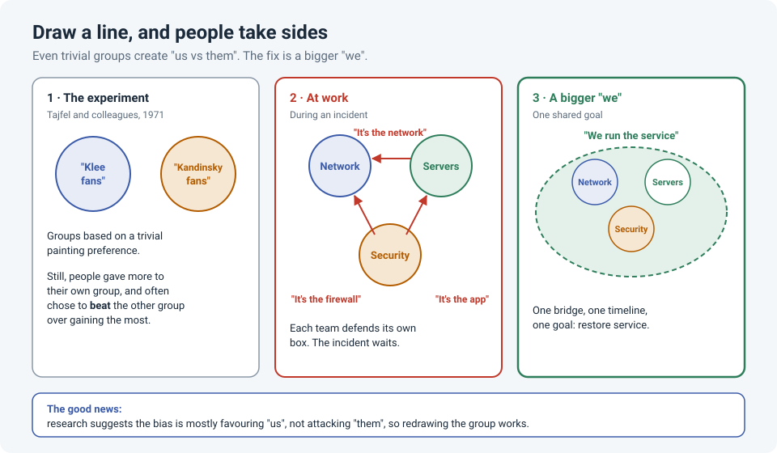

# "It's the Network": Us vs. Them and the Minimal Group Paradigm

Every network engineer has heard it: *"It's the network."* The application team points at
the network, the network team points at the firewall, security points at the application, and
the incident sits there while everyone proves it isn't their fault.

It's tempting to blame personalities. But psychology has a simpler explanation: put people in
groups, any groups, and they start favouring their own side. Understanding why helps you
defuse it.

!!! abstract "Key takeaway"
    The **minimal group paradigm** showed that even groups based on something trivial make
    people favour their own side. At work, team boundaries (network, servers, security,
    vendor) create the same "us vs. them", which slows incidents down with finger-pointing.
    The research also points to the fix: the bias is mostly about **favouring "us"**, not
    attacking "them", so creating a **bigger shared "we"** around a common goal reduces it.

## The experiment

In the early 1970s, psychologist Henri Tajfel and colleagues ran a now-famous study. Schoolboys
were shown pairs of abstract paintings and asked which they preferred. They were then told
they'd been placed in a group, either "Klee fans" or "Kandinsky fans", based on their answers.
(The assignment was essentially arbitrary.)

The groups were as **minimal** as possible: the boys never met their group, never interacted,
and gained nothing personally. Yet when asked to share out rewards between two other boys,
one from each group, they consistently gave **more to their own group**. Often they even chose
options that **maximized the gap** between the groups, over options that gave their own group
more in absolute terms. Winning mattered more than gaining.

This led to **social identity theory** (Tajfel and Turner): part of how we see ourselves
comes from the groups we belong to, so we're motivated to see "our" group favourably.

## What the bigger picture says

A meta-analysis by Balliet, Wu and De Dreu (2014), combining **212 studies**, confirmed that
people cooperate more with their own group than with outsiders. The effect is **small to
medium** overall, and it's **stronger** when people depend on each other, which is exactly the
situation inside a company.

The most useful finding for us: the bias came mainly from **favouring the in-group**, not from
**hostility toward the out-group**. People aren't out to get the other team. They just
instinctively look after their own.

## How it shows up in IT

- **Incidents:** "It's the network" before anyone has evidence. Each team proves its own box is
  fine, and nobody owns the problem between the boxes.
- **Tickets:** Bouncing a ticket between queues because it's "not ours" is faster than
  working out whose it is.
- **Vendors and partners:** "Their side" is always the suspect, even when the evidence says
  otherwise.
- **Changes:** Another team's change request gets more scrutiny than our own.

None of this needs bad people. It's what groups do by default.

## The fix: a bigger "we"

If the bias is about favouring "us", the fix is to make "us" bigger. Psychologists Gaertner and
Dovidio call this the **common ingroup identity** approach: help people see themselves as one
group with a shared goal, instead of separate teams.

In practice:

- **One incident, one team.** Run incidents on a single bridge with one timeline and one
  goal: restore the service. Nobody "wins" by being cleared; everyone wins when it's fixed.
- **Lead with evidence, not ownership.** "What does the data show?" beats "whose is it?". It's
  the same idea as asking **what** and **how** instead of **who** (see
  [When Something Breaks, Ask "What" and "How"](process-not-people.md)).
- **Share the goals and the metrics.** If network, servers and security are all measured on
  the service being up, not just on "my box is green", the incentives point the same way.
- **Build bridges before you need them.** Shadow another team for a day, invite them to your
  reviews, keep a shared chat channel. People are kinder to colleagues they know.
- **Watch your own language.** "Their change broke it" versus "the change broke it". Small
  words draw the lines.
- **Prove your side, then help.** It's fine to show the network is healthy. Then stay on the
  call and help find the real cause: that's what earns trust.

## How strong is the evidence?

| Claim | Source | Evidence strength |
|---|---|---|
| Even trivial, arbitrary groups produce in-group favouritism | Tajfel et al., 1971 | **Strong.** A classic finding, replicated many times. The original studies used schoolboys in artificial tasks |
| People cooperate more with their own group, with a small to medium effect, stronger when people depend on each other | Balliet, Wu & De Dreu, 2014 (meta-analysis of 212 studies) | **Strong.** Large meta-analysis, though mostly lab economic games |
| The bias is mainly in-group favouritism rather than out-group hostility | Balliet, Wu & De Dreu, 2014 | **Moderate to strong.** A key result of the same meta-analysis |
| A shared, larger group identity reduces bias between groups | Gaertner & Dovidio (common ingroup identity model) | **Moderate.** Well-supported in experiments; real workplaces are messier |

## References

- Tajfel, H., Billig, M. G., Bundy, R. P., & Flament, C. (1971). Social categorization and intergroup behaviour. *European Journal of Social Psychology*, 1(2), 149–178.
- Tajfel, H., & Turner, J. C. (1979). An integrative theory of intergroup conflict. In *The Social Psychology of Intergroup Relations*. Brooks/Cole.
- Balliet, D., Wu, J., & De Dreu, C. K. W. (2014). [Ingroup favoritism in cooperation: A meta-analysis](https://doi.org/10.1037/a0037737). *Psychological Bulletin*, 140(6), 1556–1581.
- Gaertner, S. L., & Dovidio, J. F. (2000). *Reducing Intergroup Bias: The Common Ingroup Identity Model*. Psychology Press.
